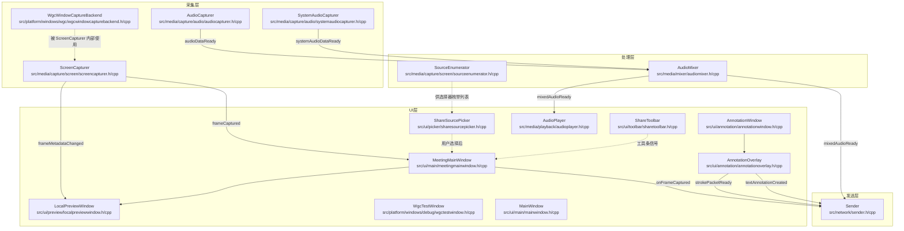

# 总体架构

面向开发者、维护者与验收人员：本文概述模块边界、线程职责与关键数据流，适合作为阅读其它技术文档前的总览。

Screen Share 是一个基于 Qt6 + C++20 的 Windows 桌面屏幕共享应用，支持屏幕共享、窗口共享、实时音频传输（麦克风 + 系统声音混音）、协同批注叠加以及本地预览。

---

## 模块全景



---

## 数据流概览

### 视频数据流

```text
[屏幕/窗口]
    ↓ capture thread 中的 QTimer 触发
ScreenCapturer::captureFrame()
    ↓ 最多保留 1 帧待主线程消费（m_inFlightFrames）
emit frameCaptured(QImage)
    ↓ queued connection
MeetingMainWindow::onFrameCaptured()
    ├─→ invokeMethod(Sender::onMainScreenFrameCaptured)  （sender thread）
    ├─→ m_lastRawFrame / m_previewDirty                  （主线程缓存）
    └─→ ScreenCapturer::releaseFrameSlot()               （释放 in-flight 槽位）
    ↓ 33 ms 合并刷新定时器
LocalPreviewWindow::updateFrame()
```

### 音频数据流

```text
[麦克风]                      [系统声音（WASAPI loopback）]
    ↓                                 ↓
AudioCapturer                    SystemAudioCapturer
    ↓ audioDataReady                  ↓ systemAudioDataReady
               ↘                   ↙
                AudioMixer::pushMicPcm / pushSystemPcm   （audio thread）
                              ↓ mixedAudioReady(QByteArray)
                  ┌───────────┴───────────┐
            queued connection       queued connection
                  ↓                           ↓
               Sender                    AudioPlayer::playData
            （sender thread）              （audio thread）
```

### 批注数据流

```text
[鼠标事件]
    ↓
AnnotationOverlay（主线程绘制）
    ↓ strokePacketReady / textAnnotationCreated
Sender（sender thread 打包发送）
    ↓
主线程 33 ms 预览定时器复用同一刷新通道
```

---

## 模块职责一览

| 模块 | 所在文件 | 职责 |
|------|---------|------|
| `ScreenCapturer` | `src/media/capture/screen/screencapturer.{h,cpp}` | 屏幕 / 窗口定时采集，多后端（`DXGI` / `WGC` / `GDI` / `GrabWindow`）切换 |
| `WgcWindowCaptureBackend` | `src/platform/windows/wgc/wgcwindowcapturebackend.{h,cpp}` | `WGC` 后端封装 |
| `WgcTestWindow` | `src/platform/windows/debug/wgctestwindow.{h,cpp}` | `WGC` 独立调试窗口（默认不编译，需 `-DSCREENSHARE_BUILD_DEBUG_WINDOWS=ON`） |
| `SourceEnumerator` | `src/media/capture/screen/sourceenumerator.{h,cpp}` | 枚举系统屏幕和可见窗口 |
| `AudioCapturer` | `src/media/capture/audio/audiocapturer.{h,cpp}` | 麦克风 PCM 采集（Qt Multimedia） |
| `SystemAudioCapturer` | `src/media/capture/audio/systemaudiocapturer.{h,cpp}` | 系统声音 loopback 采集（WASAPI） |
| `AudioMixer` | `src/media/mixer/audiomixer.{h,cpp}` | 麦克风 + 系统声音混音、重采样、ducking |
| `AudioPlayer` | `src/media/playback/audioplayer.{h,cpp}` | PCM 数据回放（Qt Multimedia） |
| `Sender` | `src/network/sender.{h,cpp}` | 多路媒体流汇聚、优先级调度、协议封包 |
| `AnnotationOverlay` | `src/ui/annotation/annotationoverlay.{h,cpp}` | 透明批注绘图层（笔迹、橡皮、文字、撤销 / 重做） |
| `AnnotationWindow` | `src/ui/annotation/annotationwindow.{h,cpp}` | 承载 `AnnotationOverlay` 的顶层透明窗口 |
| `MeetingMainWindow` | `src/ui/main/meetingmainwindow.{h,cpp}` | 主控窗口，协调各模块生命周期 |
| `ShareSourcePicker` | `src/ui/picker/sharesourcepicker.{h,cpp}` | 共享源选择对话框 |
| `ShareToolbar` | `src/ui/toolbar/sharetoolbar.{h,cpp}` | 悬浮共享控制工具条 |
| `LocalPreviewWindow` | `src/ui/preview/localpreviewwindow.{h,cpp}` | 本地预览窗口（帧预览 + 音频电平可视化） |
| `MainWindow` | `src/ui/main/mainwindow.{h,cpp}` | 调试入口窗口（默认不编译，需 `-DSCREENSHARE_BUILD_DEBUG_WINDOWS=ON`） |

---

## 线程模型

```text
main thread
├── MeetingMainWindow / ShareSourcePicker / ShareToolbar
├── LocalPreviewWindow / AnnotationWindow / AnnotationOverlay
├── m_windowFollowTimer（窗口共享跟随）
└── m_previewRefreshTimer（33 ms 合并刷新预览）

audio thread
├── AudioCapturer
├── SystemAudioCapturer
├── AudioMixer
└── AudioPlayer

capture thread
└── ScreenCapturer（QTimer 驱动采集，多后端切换）

sender thread
└── Sender（QTimer 驱动发送循环与优先级队列）
```

- `Sender` 运行在独立的 **sender thread**。主线程通过 queued connection 投递视频帧，音频线程与批注层也通过 queued connection 投递音频包和批注包；发送定时器 `m_sendTimer` 在 sender thread 内驱动。`Sender::stop()` 会停止定时器、清空所有优先级队列并断开 transport。
- `ScreenCapturer` 增加了 **in-flight 背压**：通过 `m_inFlightFrames` 保证上一帧未被主线程消费完成前不再 `emit frameCaptured`。主线程在 `MeetingMainWindow::onFrameCaptured()` 末尾调用 `releaseFrameSlot()` 释放槽位，将“无限排队”收敛为“最多保留一帧待处理”，优先保证实时性。
- 主线程预览刷新统一改为 **33 ms 合并刷新定时器**：每帧到达时只更新 `m_lastRawFrame` 与 dirty flag，由 `m_previewRefreshTimer` 周期性推送到 `LocalPreviewWindow`；批注内容变化也复用同一刷新通道。

### 安全析构顺序

```text
stopSharing()
    → Sender::stop()（sender thread）
    → 在各自线程内 deleteLater()
      （AudioCapturer / SystemAudioCapturer / AudioMixer / AudioPlayer / ScreenCapturer / Sender）
    → quit()/wait() audio thread / capture thread / sender thread
    → 最后销毁主线程 UI 子对象
```

这一顺序避免 queued 事件命中已销毁对象，也避免 `QAudio*` 与 `QTimer` 在错误线程析构导致的崩溃。

---

## 相关文档

| 文档 | 说明 |
|------|------|
| [CAPTURE.md](CAPTURE.md) | 查看采集后端、背压策略与 `WGC` / `GDI` 降级逻辑 |
| [AUDIO.md](AUDIO.md) | 查看音频采集、混音与 audio thread 细节 |
| [NETWORK.md](NETWORK.md) | 查看 `Sender` 队列、封包格式与 sender thread 调度 |
| [UI.md](UI.md) | 查看主控窗口、预览刷新和界面交互 |
| [BUILD.md](BUILD.md) | 查看构建选项与环境依赖 |
