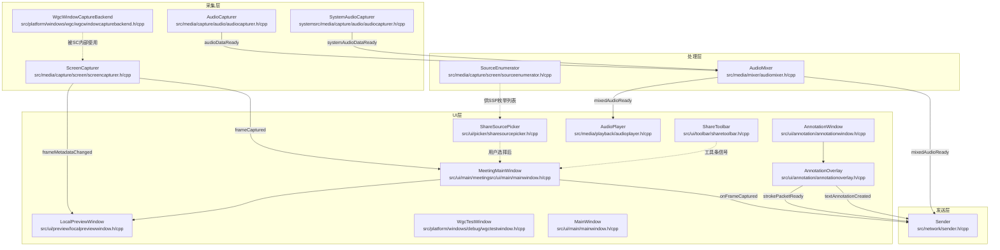

# 总体架构

## 项目简介

Screen Share 是一个基于 Qt6 + C++20 的 Windows 桌面屏幕共享/会议端应用，支持屏幕与窗口采集、实时音频传输（麦克风 + 系统声音混音）、协同批注叠加以及本地预览。

---

## 模块全景



---

## 数据流概览

### 视频数据流

```
[屏幕/窗口]
    ↓ 定时器触发（QTimer）
ScreenCapturer::captureFrame()
    ↓ emit frameCaptured(QImage)
MeetingMainWindow::onFrameCaptured()
    ├─→ Sender::onMainScreenFrameCaptured()   （网络发送）
    └─→ LocalPreviewWindow::updateFrame()     （本地预览）
```

### 音频数据流

```
[麦克风]                [系统声音（WASAPI loopback）]
    ↓                           ↓
AudioCapturer            SystemAudioCapturer
    ↓ audioDataReady             ↓ systemAudioDataReady
              ↘               ↙
               AudioMixer::pushMicPcm / pushSystemPcm
                    ↓ mixedAudioReady(QByteArray)
          ┌─────────┴──────────┐
    Sender::onAudioDataReady  AudioPlayer::playData（本地回放）
```

### 批注数据流

```
[鼠标事件]
    ↓
AnnotationOverlay（绘制）
    ↓ strokePacketReady / textAnnotationCreated
Sender（打包发送）
```

---

## 模块职责一览

| 模块 | 所在文件 | 职责 |
|------|---------|------|
| `ScreenCapturer` | `src/media/capture/screen/screencapturer.{h,cpp}` | 屏幕/窗口定时采集，多后端（DXGI / WGC / GDI / GrabWindow）切换 |
| `WgcWindowCaptureBackend` | `src/platform/windows/wgc/wgcwindowcapturebackend.{h,cpp}` | Windows Graphics Capture 后端封装 |
| `WgcTestWindow` | `src/platform/windows/debug/wgctestwindow.{h,cpp}` | WGC 功能独立测试窗口（开发调试用）|
| `SourceEnumerator` | `src/media/capture/screen/sourceenumerator.{h,cpp}` | 枚举系统屏幕和可见窗口 |
| `AudioCapturer` | `src/media/capture/audio/audiocapturer.{h,cpp}` | 麦克风 PCM 采集（Qt Multimedia）|
| `SystemAudioCapturer` | `src/media/capture/audio/systemaudiocapturer.{h,cpp}` | 系统声音 loopback 采集（WASAPI，独立线程）|
| `AudioMixer` | `src/media/mixer/audiomixer.{h,cpp}` | 麦克风 + 系统声音混音、重采样、duck 策略 |
| `AudioPlayer` | `src/media/playback/audioplayer.{h,cpp}` | PCM 数据回放（Qt Multimedia）|
| `Sender` | `src/network/sender.{h,cpp}` | 多路媒体流汇聚、优先级调度、协议封包 |
| `AnnotationOverlay` | `src/ui/annotation/annotationoverlay.{h,cpp}` | 透明批注绘图层（笔迹、橡皮、文字、撤销/重做）|
| `AnnotationWindow` | `src/ui/annotation/annotationwindow.{h,cpp}` | 承载 `AnnotationOverlay` 的全屏透明顶层窗口 |
| `MeetingMainWindow` | `src/ui/main/meetingmainwindow.{h,cpp}` | 会议主窗口，协调所有模块生命周期 |
| `ShareSourcePicker` | `src/ui/picker/sharesourcepicker.{h,cpp}` | 共享源选择对话框（屏幕/窗口/选项）|
| `ShareToolbar` | `src/ui/toolbar/sharetoolbar.{h,cpp}` | 悬浮共享控制工具条 |
| `LocalPreviewWindow` | `src/ui/preview/localpreviewwindow.{h,cpp}` | 本地预览窗口（帧预览 + 音频电平可视化）|
| `MainWindow` | `src/ui/main/mainwindow.{h,cpp}` | 应用入口窗口（目前直接打开 `AnnotationWindow` 供调试）|

---

## 线程模型

```
主线程（Qt GUI）
├── MeetingMainWindow / UI 组件
├── ScreenCapturer（QTimer 驱动，emit 信号在主线程）
└── AudioPlayer（QAudioSink 在主线程）

m_audioThread（QThread）
├── AudioCapturer（移入，通过信号跨线程投递到 AudioMixer）
└── SystemAudioCapturer 内部自带 QThread（m_thread）
    └── SystemAudioCapturerWorker（WASAPI 循环）

AudioMixer 在主线程接收跨线程信号并处理混音
Sender 在主线程执行发送循环（QTimer）
```

> 采集线程与主线程之间的数据均通过 Qt 信号槽（`Qt::QueuedConnection`）传递，天然线程安全。

---

## 详细文档索引

| 文档 | 内容 |
|------|------|
| [CAPTURE.md](CAPTURE.md) | 屏幕/窗口采集、多后端策略、状态机 |
| [AUDIO.md](AUDIO.md) | 音频采集、系统声音、混音、播放 |
| [NETWORK.md](NETWORK.md) | `Sender` 协议封包、优先级队列、编解码器接口 |
| [UI.md](UI.md) | 会议主窗口、源选择、工具条、本地预览 |
| [ANNOTATION.md](ANNOTATION.md) | 批注叠加层数据结构与交互逻辑 |
| [BUILD.md](BUILD.md) | 环境依赖、编译步骤、产物说明 |
