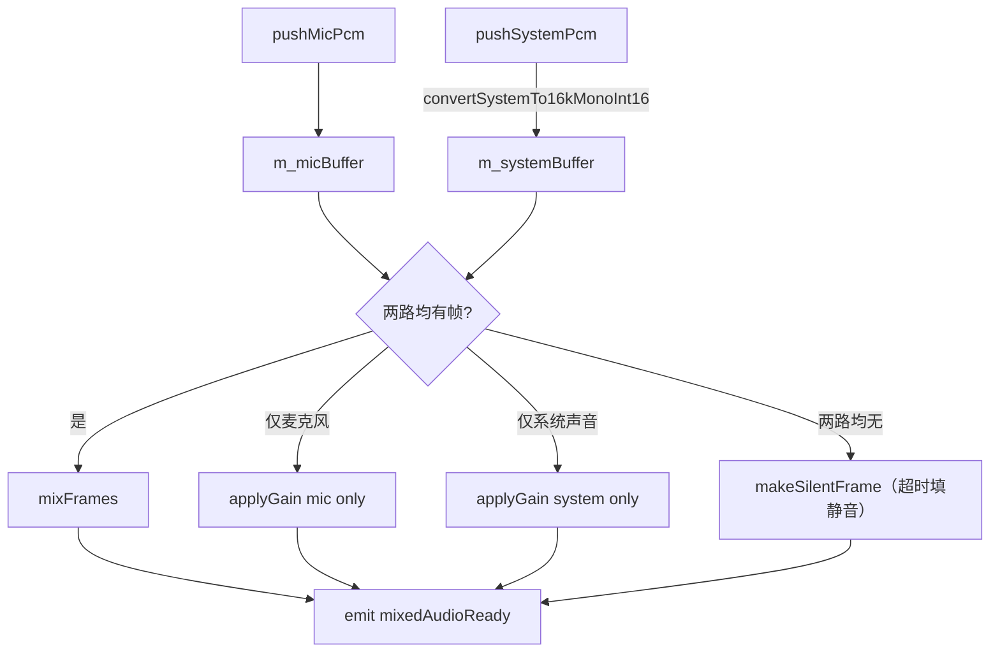

# 音频采集、混音与播放

面向开发者、维护者与验收人员：本文说明音频链路、audio thread 内的模块职责，以及与 sender thread、预览窗口之间的连接关系。

## 模块概述

音频子系统由四个模块构成完整的采集 → 处理 → 输出闭环：

| 模块 | 文件 | 职责 |
|------|------|------|
| `AudioCapturer` | `src/media/capture/audio/audiocapturer.{h,cpp}` | 麦克风 PCM 采集（Qt Multimedia） |
| `SystemAudioCapturer` | `src/media/capture/audio/systemaudiocapturer.{h,cpp}` | 系统声音 loopback 采集（WASAPI） |
| `AudioMixer` | `src/media/mixer/audiomixer.{h,cpp}` | 双路 PCM 混音、重采样、ducking |
| `AudioPlayer` | `src/media/playback/audioplayer.{h,cpp}` | PCM 数据播放（Qt Multimedia） |

`tests/test_audio_mixer.cpp` 覆盖混音、ducking 与缓冲区复位等关键逻辑。

---

## 音频格式约定

| 项 | 值 | 说明 |
|------|------|------|
| 采样率 | 16 000 Hz | 语音场景低带宽 |
| 声道数 | 1（单声道） | 降低传输体积 |
| 位深 | 16-bit signed int | `QAudioFormat::Int16` |
| 帧大小 | 640 字节 / 20 ms | `16000 × 2 × 0.02 = 640` |
| 格式标识 | PCM（未压缩） | 混音输出及 `Sender` 发送的格式 |

> `SystemAudioCapturer` 从 `WASAPI` 获取的原始数据是 **float32 交错格式**；`AudioMixer` 会在 `pushSystemPcm` 中将其重采样为 16 kHz 单声道 int16 后再参与混音。

---

## AudioCapturer

### 公开接口

| 方法 / 信号 | 说明 |
|------|------|
| `void start()` | 开始麦克风采集 |
| `void stop()` | 停止采集，释放 `QAudioSource` |
| `void setMuted(bool)` | 静音（采集继续但不发射数据） |
| `bool isRunning() const` | 是否正在采集 |
| `bool isMuted() const` | 是否已静音 |
| `void audioDataReady(const QByteArray&)` | 每帧 PCM 数据就绪（16 kHz / 1ch / 16-bit） |
| `void captureError(const QString&)` | 采集出错时发出 |

### 内部实现

- 使用 `QAudioSource` + `QMediaDevices::defaultAudioInput()` 打开默认麦克风。
- 通过 `QIODevice::readyRead` 触发批量读取。
- 音频格式由私有方法 `defaultFormat()` 统一配置（16 kHz / 1ch / Int16）。

---

## SystemAudioCapturer

系统声音采集使用 **`WASAPI` loopback**。对象本身位于 **audio thread**，内部另起一个 worker thread 执行阻塞式 `WASAPI` 循环：

```text
audio thread
└── SystemAudioCapturer（QObject）
        ├── m_thread（内部 QThread）
        └── SystemAudioCapturerWorker（移入 m_thread，执行 WASAPI loopback）
```

### 公开接口

| 方法 / 信号 | 说明 |
|------|------|
| `void setEnabled(bool)` | 启动或停止系统声音采集 |
| `bool isEnabled() const` | 当前是否已启用 |
| `void systemAudioDataReady(const QByteArray& pcm, int sampleRate, int channels)` | 原始 float32 PCM 数据就绪 |
| `void captureError(const QString&)` | 采集出错时发出 |

> `systemAudioDataReady` 携带 `sampleRate` 与 `channels` 参数，是因为 `WASAPI` loopback 的输出格式取决于当前系统音频设备；`AudioMixer` 会在 `pushSystemPcm` 中执行自适应重采样。

---

## AudioMixer

`AudioMixer` 负责将麦克风（16 kHz / 1ch / int16）与系统声音（任意采样率 / 声道数 / float32）统一为 **16 kHz 单声道 int16** PCM 流，并每 20 ms 发射一帧。

### 公开接口

| 方法 / 信号 | 说明 |
|------|------|
| `void pushMicPcm(const QByteArray& pcm16k1chInt16)` | 投入麦克风帧 |
| `void pushSystemPcm(const QByteArray& pcmFloat32Interleaved, int sampleRate, int channels)` | 投入系统声音帧 |
| `void setMicGain(double gain)` | 设置麦克风增益（0.0–2.0，默认 0.7） |
| `void setSystemGain(double gain)` | 设置系统声音增益（0.0–2.0，默认 0.5） |
| `void setDuckingEnabled(bool)` | 是否启用人声 ducking |
| `void reset()` | 清空内部缓冲区 |
| `void mixedAudioReady(const QByteArray& pcm)` | 每 20 ms 发射一帧混音结果 |

### 混音策略



**关键常量（定义于 `src/media/mixer/audiomixer.h`）：**

| 常量 | 值 | 说明 |
|------|------|------|
| `kTargetSampleRate` | 16 000 | 输出采样率 |
| `kFrameMs` | 20 | 每帧时长（ms） |
| `kFrameBytes` | 640 | 每帧字节数 |
| `kSingleBufferHardLimitMs` | 500 | 单路缓冲区上限（超过则丢弃旧数据） |
| `kSingleBufferDropMs` | 250 | 丢弃后保留的量 |
| `kSilenceFillTriggerMs` | 60 | 单路超时多久后用静音填充 |
| `kSpeechThresholdDbFs` | -30.0 | 判定人声活跃的 dBFS 阈值 |
| `kDuckingGainRatio` | 0.3 | 说话时系统声音压低至 0.3 倍 |
| `kMaxFramesPerCall` | 5 | 每次 `tryEmitFrames` 最多发射帧数 |

**重采样：** `convertSystemTo16kMonoInt16` 对系统声音执行线性插值重采样，并完成多声道 → 单声道的平均降混。

**Ducking：** 通过对麦克风近期 dBFS 做 EMA（指数移动平均）平滑；当平滑值超过 `kSpeechThresholdDbFs` 时，将系统声音增益降为 `gain × kDuckingGainRatio`。

---

## AudioPlayer

### 公开接口

| 方法 / 信号 | 说明 |
|------|------|
| `void start()` | 使用默认格式（16 kHz / 1ch / Int16）启动播放器 |
| `void start(const QAudioFormat&)` | 使用指定格式启动 |
| `void stop()` | 停止播放，释放 `QAudioSink` |
| `void playData(const QByteArray& data)` | 写入 PCM 数据（立即送入播放缓冲区） |
| `bool isRunning() const` | 是否已启动 |
| `void playerError(const QString&)` | 播放出错时发出 |

- 内部使用 `QAudioSink` + `QMediaDevices::defaultAudioOutput()` 打开默认扬声器。
- `playData` 直接向 `m_audioDevice` 写入 PCM。
- 本地回放仅用于开发调试；在扬声器与麦克风共存环境下可能产生回声，建议佩戴耳机。

---

## 线程安全说明

| 模块 | 所在线程 | 备注 |
|------|------|------|
| `AudioCapturer` | audio thread | 通过 queued connection 向 `AudioMixer`、`Sender` 和主线程投递数据 |
| `SystemAudioCapturer` | audio thread + 内部 worker thread | `WASAPI` 采集循环位于内部 worker thread |
| `AudioMixer` | audio thread | 在同一线程内处理混音，避免主线程阻塞 |
| `AudioPlayer` | audio thread | 接收 `mixedAudioReady` 后直接回放 |
| `Sender` | sender thread | 通过 queued connection 接收混音后的音频包 |

---

## MeetingMainWindow 中的连接示例

```cpp
connect(m_audioCapturer, &AudioCapturer::audioDataReady,
        m_audioMixer, &AudioMixer::pushMicPcm,
        Qt::QueuedConnection);

connect(m_systemAudioCapturer, &SystemAudioCapturer::systemAudioDataReady,
        m_audioMixer, &AudioMixer::pushSystemPcm,
        Qt::QueuedConnection);

connect(m_audioMixer, &AudioMixer::mixedAudioReady,
        m_sender, &Sender::onAudioDataReady,
        Qt::QueuedConnection);

connect(m_audioMixer, &AudioMixer::mixedAudioReady,
        m_localPlayback, &AudioPlayer::playData,
        Qt::QueuedConnection);
```

---

## 相关文档

| 文档 | 说明 |
|------|------|
| [ARCHITECTURE.md](ARCHITECTURE.md) | 查看整体线程模型与析构顺序 |
| [NETWORK.md](NETWORK.md) | 查看音频包如何进入 sender thread 并封包发送 |
| [UI.md](UI.md) | 查看本地回放开关、音量电平显示与主控流程 |
| [TEST_CHECKLIST.md](TEST_CHECKLIST.md) | 查看音频功能、ducking 与回放的验收步骤 |
