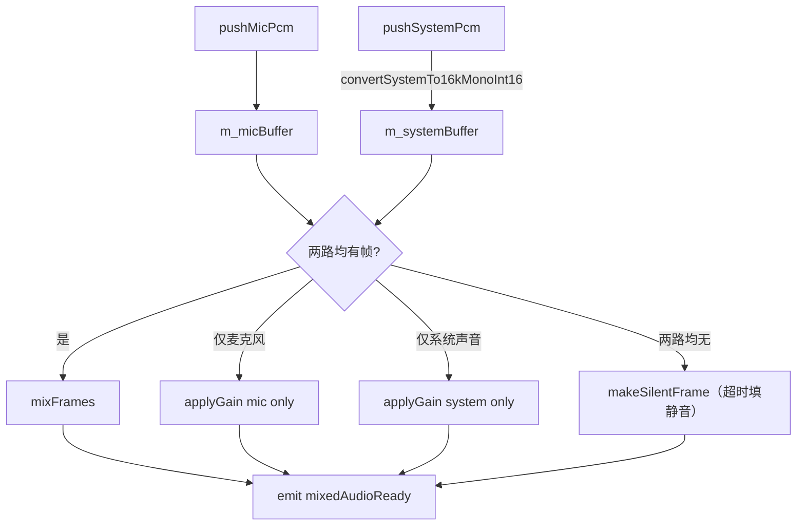

# 音频采集、混音与播放

## 模块概述

音频子系统由四个类共同构成完整的采集→处理→输出闭环：

| 类 | 文件 | 职责 |
|----|------|------|
| `AudioCapturer` | `audiocapturer.{h,cpp}` | 麦克风 PCM 采集（Qt Multimedia）|
| `SystemAudioCapturer` | `systemaudiocapturer.{h,cpp}` | 系统声音 loopback 采集（WASAPI，独立线程）|
| `AudioMixer` | `audiomixer.{h,cpp}` | 双路 PCM 混音、重采样、duck 策略 |
| `AudioPlayer` | `audioplayer.{h,cpp}` | PCM 数据播放（Qt Multimedia）|

---

## 音频格式约定

| 参数 | 值 | 说明 |
|------|----|------|
| 采样率 | 16 000 Hz | 语音场景低带宽 |
| 声道数 | 1（单声道）| 降低传输体积 |
| 位深 | 16-bit signed int | `QAudioFormat::Int16` |
| 帧大小 | 640 字节 / 20 ms | `16000 × 2 × 0.02 = 640` |
| 格式标识 | PCM（未压缩）| 混音输出及 Sender 发送的格式 |

> `SystemAudioCapturer` 从 WASAPI 拿到的原始数据为 **float32 交错** 格式，经 `AudioMixer` 重采样到 16 kHz 单声道 int16 后再混音。

---

## AudioCapturer

### 公开接口

| 方法 / 信号 | 说明 |
|------------|------|
| `void start()` | 开始麦克风采集 |
| `void stop()` | 停止采集，释放 `QAudioSource` |
| `void setMuted(bool)` | 静音（采集继续但不 emit 数据）|
| `bool isRunning() const` | 是否正在采集 |
| `bool isMuted() const` | 是否已静音 |
| `void audioDataReady(const QByteArray&)` | 每帧 PCM 数据就绪（16 kHz / 1ch / 16-bit）|
| `void captureError(const QString&)` | 采集出错时发出 |

### 内部实现

- 使用 `QAudioSource` + `QMediaDevices::defaultAudioInput()` 打开默认麦克风
- 以 `QIODevice` 的 `readyRead` 信号（私有槽 `onDataReady`）触发批量读取
- 音频格式由私有方法 `defaultFormat()` 统一配置（16 kHz / 1ch / Int16）

---

## SystemAudioCapturer

系统声音（loopback）采集使用 **Windows WASAPI** 的 loopback 模式，由于 WASAPI API 为阻塞调用，采用独立 `QThread` 隔离：

### 架构

```
主线程
└── SystemAudioCapturer（QObject）
        ├── m_thread（QThread）
        └── SystemAudioCapturerWorker（移入 m_thread，内部 WASAPI 循环）
```

### 公开接口

| 方法 / 信号 | 说明 |
|------------|------|
| `void setEnabled(bool)` | 启动或停止系统声音采集 |
| `bool isEnabled() const` | 当前是否已启用 |
| `void systemAudioDataReady(const QByteArray& pcm, int sampleRate, int channels)` | 原始 float32 PCM 数据就绪（含采样率和声道数）|
| `void captureError(const QString&)` | 采集出错时发出 |

> `systemAudioDataReady` 携带 `sampleRate` 和 `channels` 参数，是因为 WASAPI loopback 捕获的格式取决于系统当前音频设备的输出格式，并非固定值。`AudioMixer` 在 `pushSystemPcm` 中执行自适应重采样。

---

## AudioMixer

`AudioMixer` 负责将麦克风（16 kHz/1ch/int16）和系统声音（任意采样率/声道数/float32）合并为统一的 **16 kHz 单声道 int16** PCM 流，每 20 ms 发射一帧。

### 公开接口

| 方法 / 信号 | 说明 |
|------------|------|
| `void pushMicPcm(const QByteArray& pcm16k1chInt16)` | 投入麦克风帧（可跨线程）|
| `void pushSystemPcm(const QByteArray& pcmFloat32Interleaved, int sampleRate, int channels)` | 投入系统声音帧 |
| `void setMicGain(double gain)` | 设置麦克风增益（0.0–2.0，默认 0.7）|
| `void setSystemGain(double gain)` | 设置系统声音增益（0.0–2.0，默认 0.5）|
| `void setDuckingEnabled(bool)` | 是否启用人声 ducking（麦克风说话时压低系统声音）|
| `void reset()` | 清空内部缓冲区 |
| `void mixedAudioReady(const QByteArray& pcm)` | 每 20 ms 发射一帧混音结果 |

### 混音策略



**关键常量（定义于 `audiomixer.h`）：**

| 常量 | 值 | 说明 |
|------|----|------|
| `kTargetSampleRate` | 16 000 | 输出采样率 |
| `kFrameMs` | 20 | 每帧时长（ms）|
| `kFrameBytes` | 640 | 每帧字节数 |
| `kSingleBufferHardLimitMs` | 500 | 单路缓冲区上限（超过则丢弃旧数据）|
| `kSingleBufferDropMs` | 250 | 丢弃后保留的量 |
| `kSilenceFillTriggerMs` | 60 | 单路超时多久后用静音填充 |
| `kSpeechThresholdDbFs` | -30.0 | 判定人声活跃的 dBFS 阈值 |
| `kDuckingGainRatio` | 0.3 | 说话时系统声音压低至 0.3 倍 |
| `kMaxFramesPerCall` | 5 | 每次 `tryEmitFrames` 最多发射帧数（防抖动）|

**重采样：** `convertSystemTo16kMonoInt16` 对系统声音做线性插值重采样，同时完成多声道→单声道的平均降混，输出 int16。

**Ducking：** 通过对麦克风近期 dBFS 做 EMA（指数移动平均）平滑，当平滑值超过 `kSpeechThresholdDbFs` 时将系统声音增益降至 `gain × kDuckingGainRatio`，实现"说话压低背景音"效果。

---

## AudioPlayer

### 公开接口

| 方法 / 信号 | 说明 |
|------------|------|
| `void start()` | 使用默认格式（16 kHz/1ch/Int16）启动播放器 |
| `void start(const QAudioFormat&)` | 使用指定格式启动 |
| `void stop()` | 停止播放，释放 `QAudioSink` |
| `void playData(const QByteArray& data)` | 写入 PCM 数据（立即送入播放缓冲区）|
| `bool isRunning() const` | 是否已启动 |
| `void playerError(const QString&)` | 播放出错时发出 |

- 内部使用 `QAudioSink` + `QMediaDevices::defaultAudioOutput()` 打开默认扬声器
- `playData` 将 PCM 直接写入 `QIODevice`（`m_audioDevice`）

> **注意**：本地回放仅用于开发调试。在扬声器与麦克风共存的环境下会产生回声啸叫，**请使用耳机**。

---

## 线程安全说明

| 模块 | 线程 | 备注 |
|------|------|------|
| `AudioCapturer` | 移入 `m_audioThread` | 通过 `Qt::QueuedConnection` 向主线程投递数据 |
| `SystemAudioCapturer` | 主线程持有对象；`Worker` 在 `m_thread` 运行 | 信号从 worker 线程 emit，由 Qt 自动排队到主线程 |
| `AudioMixer` | 主线程 | 接收跨线程信号后在主线程处理 |
| `AudioPlayer` | 主线程 | `playData` 由主线程调用 |

---

## MeetingMainWindow 中的连接示例

```cpp
// 麦克风 → 混音器
connect(m_audioCapturer, &AudioCapturer::audioDataReady,
        m_audioMixer,    &AudioMixer::pushMicPcm);

// 系统声音 → 混音器
connect(m_systemAudioCapturer, &SystemAudioCapturer::systemAudioDataReady,
        m_audioMixer,          &AudioMixer::pushSystemPcm);

// 混音结果 → Sender（网络发送）
connect(m_audioMixer, &AudioMixer::mixedAudioReady,
        m_sender,     &Sender::onAudioDataReady);

// 混音结果 → 本地回放
connect(m_audioMixer,    &AudioMixer::mixedAudioReady,
        m_localPlayback, &AudioPlayer::playData);
```

---

## 扩展路线

| 阶段 | 内容 |
|------|------|
| 当前 | PCM 透传 + 本地调试回放；WASAPI loopback + 线性插值重采样 + duck |
| 近期 | 接入真实 UDP/RTP 传输，`Sender` 对端实际接收并播放 |
| 中期 | 集成 libopus 编码，替换 `PcmAudioEncoder` |
| 远期 | WebRTC APM（AEC/NS/AGC）、多设备选择、SFU 多人混音 |
