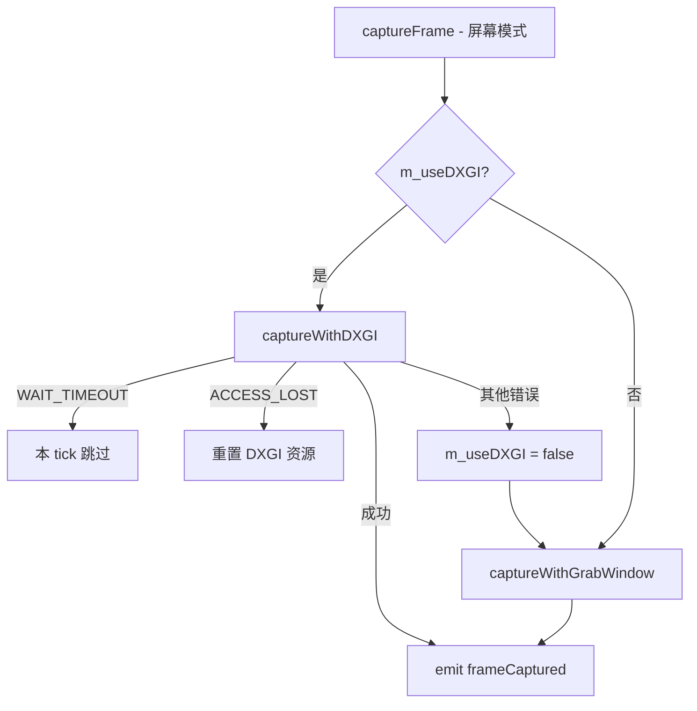
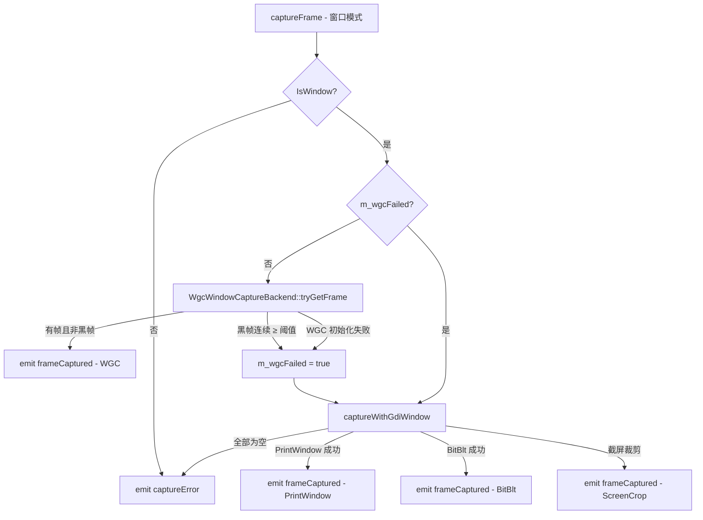
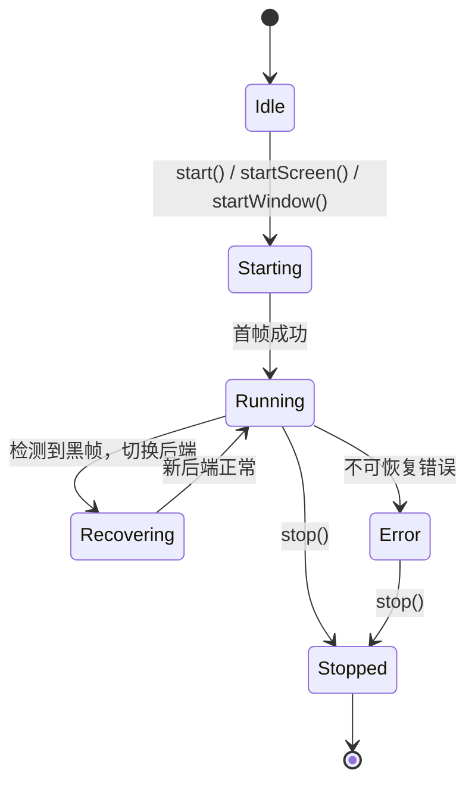

# 屏幕与窗口采集

面向开发者、维护者与验收人员：本文说明屏幕共享与窗口共享的采集链路、多后端切换策略，以及与主线程预览、发送端之间的接口约定。

## 模块概述

屏幕与窗口采集由以下两个类共同实现：

| 模块 | 文件 | 职责 |
|------|------|------|
| `ScreenCapturer` | `src/media/capture/screen/screencapturer.{h,cpp}` | 定时触发采集、多后端切换、黑帧检测、背压控制、信号发射 |
| `WgcWindowCaptureBackend` | `src/platform/windows/wgc/wgcwindowcapturebackend.{h,cpp}` | `WGC` 后端封装 |

辅助模块：

| 模块 | 文件 | 职责 |
|------|------|------|
| `SourceEnumerator` | `src/media/capture/screen/sourceenumerator.{h,cpp}` | 枚举屏幕与可见窗口，供 UI 层使用 |
| `WgcTestWindow` | `src/platform/windows/debug/wgctestwindow.{h,cpp}` | `WGC` 独立测试 / 调试窗口（默认不编译，需 `-DSCREENSHARE_BUILD_DEBUG_WINDOWS=ON`） |

`tests/test_screen_capturer_helpers.cpp` 覆盖黑帧判定逻辑，`tests/test_capture_smoke_windows.cpp` 覆盖 Windows 下真实采集链路的交互式冒烟验证。

---

## ScreenCapturer 公开接口

### 启动与停止

| 方法 | 说明 |
|------|------|
| `start(int fps = 30)` | 采集主屏幕，默认 30 fps |
| `startScreen(int screenIndex, int fps = 30)` | 采集指定序号屏幕 |
| `startWindow(quintptr windowId, int fps = 30)` | 采集指定窗口句柄 |
| `stop()` | 停止采集，释放 `WGC` / `DXGI` 资源并清空背压状态 |
| `pause()` / `resume()` | 暂停 / 恢复采集（不释放资源） |
| `isRunning() const` | 是否正在运行 |
| `isPaused() const` | 是否已暂停 |
| `setOutputSize(const QSize&)` | 设置输出分辨率（默认 1280×720，屏幕模式有效） |
| `outputSize() const` | 获取当前输出分辨率 |
| `setWgcOptions(bool cursor, bool border, int minUpdateMs)` | 配置 `WGC` 选项（光标显示、边框提示、最小更新间隔） |
| `releaseFrameSlot()` | 由主线程在消费完成一帧后调用，释放 in-flight 槽位 |

### 信号

| 信号 | 说明 |
|------|------|
| `frameCaptured(const QImage& frame)` | 每帧采集完成，格式 `Format_RGB32` |
| `captureError(const QString& msg)` | 采集出错（如窗口已关闭、最小化或不可捕获） |
| `frameMetadataChanged(const CaptureFrameMetadata& meta)` | 帧元数据变化（分辨率、后端名等） |

### CaptureFrameMetadata

定义于 `src/media/capture/screen/screencapturer.h`：

| 字段 | 类型 | 说明 |
|------|------|------|
| `sourceSize` | `QSize` | 采集源原始分辨率 |
| `sourceGeometry` | `QRect` | 采集区域在屏幕坐标系中的位置 |
| `windowHandle` | `quintptr` | 窗口句柄（屏幕模式时为 0） |
| `backendName` | `QString` | 实际使用的后端名称（见下表） |
| `frameIndex` | `qint64` | 本次会话已采集帧数（从 1 累加） |

### 采集状态枚举

```cpp
enum class CaptureState { Idle, Starting, Running, Recovering, Error, Stopped };
```

---

## 采集后端

### 后端一览

| 后端名（`backendName`） | 适用场景 | 输出分辨率 | 平台 |
|------|------|------|------|
| `DXGI` | 屏幕共享（GPU 直出，可截游戏 / 视频） | 缩放至 `outputSize` | Windows |
| `GrabWindow` | 屏幕共享的跨平台降级路径 | 缩放至 `outputSize` | 全平台 |
| `WGC` | 窗口共享（Windows 10 1803+） | 原始窗口分辨率 | Windows |
| `PrintWindow` | 窗口共享 `GDI` 主路径 | 原始窗口分辨率 | Windows |
| `BitBlt` | 窗口共享 `GDI` 次路径 | 原始窗口分辨率 | Windows |
| `ScreenCrop` | 窗口共享截屏裁剪兜底路径 | 原始窗口分辨率 | Windows |

### 屏幕模式降级策略



**DXGI Desktop Duplication（`captureWithDXGI`）**
- `ID3D11Device` + `IDXGIOutputDuplication` 只初始化一次，后续帧复用。
- `m_stagingTexture` 缓存 CPU 可读 staging texture，避免每帧重建。
- `DXGI_ERROR_ACCESS_LOST` 时自动重置，下次重建。
- `DXGI_ERROR_WAIT_TIMEOUT` 时跳过当前 tick，不立即降级。
- 真正失败后才将 `m_useDXGI` 置 `false`，切换到 `GrabWindow`。

**GrabWindow（`captureWithGrabWindow`）**
- 调用 `QScreen::grabWindow(0)` 截取整屏。
- 多屏按 `m_screenIndex` 选择对应 `QScreen`。
- 输出缩放到 `m_outputSize`。

### 窗口模式降级策略



**WGC（`WgcWindowCaptureBackend`）**
- 仅 Windows 10 1803+，通过 `isSupported()` 做运行时检测。
- `Direct3D11CaptureFramePool` 的缓冲数已从 2 提升到 **3**，用于降低窗口共享路径的固有排队延迟。
- `tryGetFrame()` 会循环调用 `TryGetNextFrame()`，**drain 掉旧帧，仅保留最新一帧** 再上传到 CPU staging texture，减少 1–2 帧积压造成的滞后。
- 帧池在尺寸变化时会执行 `Recreate(...)`，并继续使用 **3-buffer** 配置。
- 支持 `setCursorCaptureEnabled` / `setBorderRequired` / `setMinUpdateInterval` 三项配置。
- `lastFrameSize()` 返回原始帧尺寸，并写入 `CaptureFrameMetadata`。

**黑帧检测（`imageLooksMostlyBlack`）**
- 均匀采样最多 80×80 像素。
- 亮度（RGB 最大通道）< 30 视为黑像素。
- 黑像素占比 > 92% 则判定为黑帧。
- `WGC` 连续 `m_blackFrameThreshold`（默认 4）次黑帧后将 `m_wgcFailed = true`，切换到 `GDI`。

**GDI（`captureWithGdiWindow`）**
- 依次尝试 `PrintWindow(PW_RENDERFULLCONTENT)` → `BitBlt` → `ScreenCrop`（按窗口矩形裁剪）。
- 输出保留原始窗口分辨率，不强制缩放。

### 背压与主线程消费

`ScreenCapturer` 通过 `m_inFlightFrames` 实现 **单槽背压**：

- `emitFrameWithStats()` 在发射 `frameCaptured` 之前先执行 `m_inFlightFrames.exchange(1)`。
- 若上一帧尚未被主线程消费完成，则当前帧直接丢弃，不继续堆积排队。
- 主线程在 `MeetingMainWindow::onFrameCaptured()` 结束时调用 `releaseFrameSlot()`，释放槽位。
- 该策略将“无限排队”改为“最多保留一帧待处理”，优先保证窗口共享和预览的实时性。

---

## 采集状态机



---

## 关键私有成员

| 成员 | 类型 | 说明 |
|------|------|------|
| `m_useDXGI` | `bool` | 是否继续尝试 `DXGI`（失败后永久 false） |
| `m_wgcFailed` | `bool` | `WGC` 是否已失败（true 后走 `GDI`） |
| `m_blackFrameCount` | `int` | 连续黑帧计数器 |
| `m_blackFrameThreshold` | `int` | 黑帧切换阈值（默认 4） |
| `m_outputSize` | `QSize` | 输出分辨率（默认 1280×720） |
| `m_frameIndex` | `qint64` | 当前会话帧序号 |
| `m_paused` | `bool` | 是否暂停（不释放资源） |
| `m_inFlightFrames` | `std::atomic<int>` | 主线程消费背压槽位 |
| `m_d3dDevice / m_d3dContext` | `ComPtr<>` | D3D11 设备（`DXGI` 复用） |
| `m_duplication` | `ComPtr<IDXGIOutputDuplication>` | `DXGI` 输出复制对象 |
| `m_stagingTexture` | `ComPtr<ID3D11Texture2D>` | CPU 可读 staging texture |
| `m_wgcBackend` | `unique_ptr<WgcWindowCaptureBackend>` | `WGC` 后端实例 |

---

## WgcWindowCaptureBackend 接口

定义于 `src/platform/windows/wgc/wgcwindowcapturebackend.h`，使用 Pimpl 封装 WinRT / C++/WinRT 依赖：

| 方法 | 说明 |
|------|------|
| `static bool isSupported()` | 检测 Windows 10 1803+ `WGC` API 可用性 |
| `bool start(HWND hwnd)` | 初始化 CaptureItem + 3-buffer FramePool + Session |
| `void stop()` | 释放所有 WinRT / D3D 资源 |
| `bool isRunning() const` | 后端是否已启动 |
| `void setCursorCaptureEnabled(bool)` | 是否在帧中包含鼠标光标 |
| `void setBorderRequired(bool)` | 是否显示 `WGC` 黄色边框提示 |
| `void setMinUpdateInterval(int ms)` | 最小帧更新间隔（ms） |
| `QImage tryGetFrame()` | 取最新帧；若队列中积压多帧，则只保留最新一帧 |
| `QSize lastFrameSize() const` | 最近一帧的原始尺寸 |

---

## SourceEnumerator 接口

定义于 `src/media/capture/screen/sourceenumerator.h`，提供静态枚举方法：

```cpp
QList<ScreenInfo> screens = SourceEnumerator::enumerateScreens();
// ScreenInfo: { int index, QString name, QSize resolution, QRect geometry }

QList<WindowInfo> windows = SourceEnumerator::enumerateWindows();
// WindowInfo: { quintptr handle, QString title, bool minimized }
```

枚举结果由 `ShareSourcePicker` 构建选择列表，用户选择后将 `index` 或 `handle` 传入 `ScreenCapturer::startScreen()` / `startWindow()`。

---

## 与其他模块的集成

```cpp
connect(m_capturer, &ScreenCapturer::frameCaptured,
        this, &MeetingMainWindow::onFrameCaptured,
        Qt::QueuedConnection);

connect(m_capturer, &ScreenCapturer::frameMetadataChanged,
        this, [this](const CaptureFrameMetadata& meta) {
            if (m_preview) {
                m_preview->updateMetadata(meta);
            }
        },
        Qt::QueuedConnection);

connect(m_capturer, &ScreenCapturer::captureError,
        this, &MeetingMainWindow::handleCaptureError,
        Qt::QueuedConnection);
```

---

## 相关文档

| 文档 | 说明 |
|------|------|
| [ARCHITECTURE.md](ARCHITECTURE.md) | 查看整体线程模型、sender thread 与析构顺序 |
| [UI.md](UI.md) | 查看主线程预览刷新、窗口跟随与界面交互 |
| [BUILD.md](BUILD.md) | 查看 `SCREENSHARE_BUILD_DEBUG_WINDOWS`、测试开关与环境依赖 |
| [TEST_CHECKLIST.md](TEST_CHECKLIST.md) | 查看窗口共享、屏幕共享和退出稳定性的验收步骤 |
