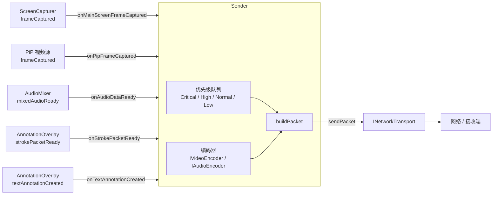

# 网络协议与发送端

## 模块概述

`Sender`（`src/network/sender.{h,cpp}`）是整个屏幕共享系统的**媒体调度核心**，负责：

1. 接收来自 `ScreenCapturer`、`AudioMixer`、`AnnotationOverlay` 的多路媒体数据；
2. 按优先级队列调度，将数据打包为固定格式数据包；
3. 通过可替换的 `INetworkTransport` 接口发送给接收端。

---

## 整体架构



---

## 枚举与数据结构

### StreamType

| 值 | 说明 |
|----|------|
| `Video = 0` | 视频流（主屏 / PiP）|
| `Audio = 1` | 音频流 |
| `Annotation = 2` | 批注流（笔划 / 文字）|
| `Control = 3` | 控制流（预留）|

### SourceKind

| 值 | 说明 |
|----|------|
| `DesktopMain = 0` | 主桌面截图 |
| `CameraPip = 1` | 摄像头画中画 |
| `Microphone = 2` | 麦克风音频 |
| `AnnotationStroke = 3` | 批注笔划 |
| `AnnotationText = 4` | 文字批注 |
| `SystemControl = 5` | 系统控制（预留）|

### SendPriority

| 值 | 适用场景 |
|----|---------|
| `Critical = 0` | 音频（不可丢帧）|
| `High = 1` | 批注（实时性强）|
| `Normal = 2` | 主视频帧 |
| `Low = 3` | PiP / 低优先级帧 |

### PacketHeader（固定 24 字节）

定义于 `src/network/sender.h`：

| 字段 | 类型 | 说明 |
|------|------|------|
| `version` | `quint8` | 协议版本（当前为 1）|
| `streamType` | `quint8` | 对应 `StreamType` 枚举值 |
| `flags` | `quint16` | 扩展标志位（保留，当前为 0）|
| `streamId` | `quint32` | 流唯一标识（`registerXxxStream` 返回值）|
| `timestampUs` | `quint64` | 发送时刻（微秒，`QElapsedTimer` 计时）|
| `sequence` | `quint32` | 本流包序号（从 1 单调递增）|
| `payloadSize` | `quint32` | payload 长度（字节）|

数据包布局：`[PacketHeader (24 B)][payload (payloadSize B)]`

---

## Sender 公开接口

### 生命周期

| 方法 | 说明 |
|------|------|
| `bool start()` | 启动发送循环（内部 `QTimer` 驱动 `processSendLoop`）|
| `void stop()` | 停止发送循环，清空队列 |
| `bool isRunning() const` | 是否正在运行 |
| `void setTransport(INetworkTransport*)` | 切换网络传输实现（可在运行中热切换）|

### 流注册

```cpp
// 注册主视频流（返回 StreamId）
StreamId vid = sender.registerVideoStream(
    SourceKind::DesktopMain, SendPriority::Normal, /*enabled=*/true, /*maxFps=*/30, /*quality=*/75);

// 注册音频流
StreamId aud = sender.registerAudioStream(
    SourceKind::Microphone, SendPriority::Critical, true);

// 注册批注笔划流
StreamId ann = sender.registerAnnotationStream(
    SourceKind::AnnotationStroke, SendPriority::High, true);
```

每条流拥有独立的序号计数器（`nextSequence`）和限速时间戳（`lastFrameTimestampUs`）。

### 流管理

| 方法 | 说明 |
|------|------|
| `void unregisterStream(StreamId)` | 注销并释放流 |
| `void setTargetBitrate(quint32 bps)` | 设置目标码率（供自适应码率扩展使用）|
| `void setMaxFps(StreamId, int)` | 动态调整某路视频最大帧率 |
| `void setVideoQuality(StreamId, int)` | 动态调整某路视频编码质量（JPEG quality）|
| `void setStreamEnabled(StreamId, bool)` | 暂停/恢复某路流 |

### 预置 StreamId 访问器

```cpp
StreamId mainVideoStreamId() const;
StreamId pipVideoStreamId() const;
StreamId audioStreamId() const;
StreamId annotationStrokeStreamId() const;
StreamId annotationTextStreamId() const;
```

### 数据槽

| 槽 | 触发方 |
|----|--------|
| `onMainScreenFrameCaptured(const QImage&)` | `ScreenCapturer::frameCaptured` |
| `onPipFrameCaptured(const QImage&)` | PiP 视频源 |
| `onAudioDataReady(const QByteArray&)` | `AudioMixer::mixedAudioReady` |
| `onStrokePacketReady(const StrokePacket&)` | `AnnotationOverlay::strokePacketReady` |
| `onTextAnnotationCreated(const TextAnnotation&)` | `AnnotationOverlay::textAnnotationCreated` |

---

## 编码器接口

### IVideoEncoder

```cpp
virtual QByteArray encode(const QImage& frame, int quality) = 0;
```

当前实现：**`JpegVideoEncoder`**，使用 Qt 内置 JPEG 编码，`quality` 默认 75，可通过 `setVideoQuality` 动态调整。

### IAudioEncoder

```cpp
virtual QByteArray encode(const QByteArray& pcm) = 0;
```

当前实现：**`PcmAudioEncoder`**，直接透传原始 PCM，不做压缩。

> **升级路径**：替换 `JpegVideoEncoder` 为 H.264/H.265 软编、`PcmAudioEncoder` 为 Opus，只需注入不同实现，`Sender` 本身无需修改。

---

## 批注序列化

`AnnotationSerializer`（定义于 `src/network/sender.h`）提供两个静态方法：

```cpp
static QByteArray serializeStroke(const StrokePacket& pkt);
static QByteArray serializeText(const TextAnnotation& text);
```

批注数据被序列化为字节流后作为 `Annotation` 类型包的 payload。

---

## 网络传输接口

```cpp
class INetworkTransport {
public:
    virtual bool sendPacket(const QByteArray& packet, bool reliable) = 0;
};
```

- `reliable = true`：要求可靠送达（批注、控制包），对应 TCP 语义；
- `reliable = false`：允许丢弃（视频帧），对应 UDP 语义。

当前调试实现：**`DebugTransport`**，仅打印包摘要信息，不做真实网络发送。

---

## 优先级队列调度

`processSendLoop()` 由内部 `QTimer` 周期触发，每轮按以下顺序取包：

```
Critical → High → Normal → Low
```

- **视频帧丢弃**：`dropOldVideoPacketsForStream` 在视频队列积压时丢弃最旧的帧，保证实时性。
- **音频帧不丢弃**：Critical 队列不执行丢弃逻辑，保证完整传输。

---

## 集成示例

```cpp
// MeetingMainWindow 启动共享时
m_sender = new Sender(this);
m_sender->setTransport(new DebugTransport());

StreamId vid = m_sender->registerVideoStream(SourceKind::DesktopMain,
                                             SendPriority::Normal, true, 30, 75);
StreamId aud = m_sender->registerAudioStream(SourceKind::Microphone,
                                             SendPriority::Critical, true);
StreamId ann = m_sender->registerAnnotationStream(SourceKind::AnnotationStroke,
                                                  SendPriority::High, true);

connect(m_capturer, &ScreenCapturer::frameCaptured,
        m_sender,   &Sender::onMainScreenFrameCaptured);
connect(m_audioMixer, &AudioMixer::mixedAudioReady,
        m_sender,     &Sender::onAudioDataReady);
connect(m_annotationWindow, &AnnotationWindow::strokePacketReady,
        m_sender,           &Sender::onStrokePacketReady);
connect(m_annotationWindow, &AnnotationWindow::textAnnotationCreated,
        m_sender,           &Sender::onTextAnnotationCreated);

m_sender->start();
```

---

## 扩展路线

| 阶段 | 内容 |
|------|------|
| 当前 | JPEG 视频 + PCM 音频 + `DebugTransport`（无实际发送）|
| 近期 | 替换 `DebugTransport`，接入真实 TCP/UDP 传输层 |
| 中期 | 替换 `JpegVideoEncoder` 为 H.264/H.265 |
| 远期 | 替换 `PcmAudioEncoder` 为 Opus，支持自适应码率，多路 PiP |
