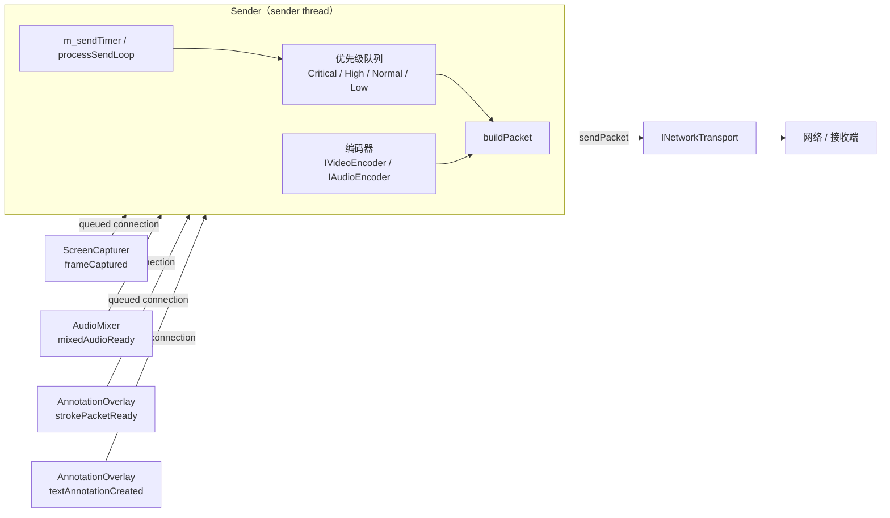

# 网络协议与发送端

面向开发者、维护者与验收人员：本文说明 `Sender` 的封包格式、优先级队列与 sender thread 执行模型，适合作为网络层与媒体层的接口说明。

## 模块概述

`Sender`（`src/network/sender.{h,cpp}`）负责：

1. 接收来自 `ScreenCapturer`、`AudioMixer`、`AnnotationOverlay` 的多路媒体数据；
2. 按优先级队列调度，将数据打包为固定格式数据包；
3. 通过可替换的 `INetworkTransport` 接口发送给接收端。

`tests/test_sender_queue.cpp` 覆盖优先级调度、视频旧包丢弃与 `stop()` 清队列行为。

---

## 整体架构



---

## 枚举与数据结构

### StreamType

| 值 | 说明 |
|------|------|
| `Video = 0` | 视频流（主视频 / PiP） |
| `Audio = 1` | 音频流 |
| `Annotation = 2` | 批注流（笔划 / 文字） |
| `Control = 3` | 控制流（预留） |

### SourceKind

| 值 | 说明 |
|------|------|
| `DesktopMain = 0` | 主桌面或共享窗口视频 |
| `CameraPip = 1` | 摄像头画中画 |
| `Microphone = 2` | 麦克风音频 |
| `AnnotationStroke = 3` | 批注笔划 |
| `AnnotationText = 4` | 文字批注 |
| `SystemControl = 5` | 系统控制（预留） |

### SendPriority

| 值 | 适用场景 |
|------|------|
| `Critical = 0` | 音频（尽量不丢包） |
| `High = 1` | 批注（实时性强） |
| `Normal = 2` | 主视频帧 |
| `Low = 3` | PiP / 低优先级帧 |

### PacketHeader（固定 24 字节）

定义于 `src/network/sender.h`：

| 字段 | 类型 | 说明 |
|------|------|------|
| `version` | `quint8` | 协议版本（当前为 1） |
| `streamType` | `quint8` | 对应 `StreamType` 枚举值 |
| `flags` | `quint16` | 扩展标志位（当前为 0） |
| `streamId` | `quint32` | 流唯一标识 |
| `timestampUs` | `quint64` | 发送时刻（微秒） |
| `sequence` | `quint32` | 本流包序号（从 1 单调递增） |
| `payloadSize` | `quint32` | payload 长度（字节） |

数据包布局：`[PacketHeader (24 B)][payload (payloadSize B)]`

---

## Sender 公开接口

### 生命周期

| 方法 | 说明 |
|------|------|
| `bool start()` | 启动发送循环；内部 `QTimer` 在 sender thread 中驱动 `processSendLoop()` |
| `void stop()` | 停止发送循环，清空所有优先级队列并断开 transport |
| `bool isRunning() const` | 是否正在运行 |
| `void setTransport(INetworkTransport*)` | 切换网络传输实现（可在运行中热切换） |

### 流注册

```cpp
StreamId vid = sender.registerVideoStream(
    SourceKind::DesktopMain, SendPriority::Normal, true, 30, 75);

StreamId aud = sender.registerAudioStream(
    SourceKind::Microphone, SendPriority::Critical, true);

StreamId ann = sender.registerAnnotationStream(
    SourceKind::AnnotationStroke, SendPriority::High, true);
```

每条流拥有独立的序号计数器（`nextSequence`）和限速时间戳（`lastFrameTimestampUs`）。

### 流管理

| 方法 | 说明 |
|------|------|
| `void unregisterStream(StreamId)` | 注销并释放流 |
| `void setTargetBitrate(quint32 bps)` | 设置目标码率（供后续自适应扩展使用） |
| `void setMaxFps(StreamId, int)` | 动态调整某路视频最大帧率 |
| `void setVideoQuality(StreamId, int)` | 动态调整某路视频编码质量（JPEG quality） |
| `void setStreamEnabled(StreamId, bool)` | 暂停 / 恢复某路流 |

### 预置 StreamId 访问器

```cpp
StreamId mainVideoStreamId() const;
StreamId pipVideoStreamId() const;
StreamId audioStreamId() const;
StreamId annotationStrokeStreamId() const;
StreamId annotationTextStreamId() const;
```

### 数据槽

| 槽 | 触发方 |
|------|------|
| `onMainScreenFrameCaptured(const QImage&)` | `ScreenCapturer::frameCaptured` |
| `onPipFrameCaptured(const QImage&)` | PiP 视频源 |
| `onAudioDataReady(const QByteArray&)` | `AudioMixer::mixedAudioReady` |
| `onStrokePacketReady(const StrokePacket&)` | `AnnotationOverlay::strokePacketReady` |
| `onTextAnnotationCreated(const TextAnnotation&)` | `AnnotationOverlay::textAnnotationCreated` |

---

## sender thread 执行模型

- `MeetingMainWindow` 在启动时将 `Sender` 移入独立的 **sender thread**。
- 主线程、audio thread 与批注层通过 queued connection / `QMetaObject::invokeMethod` 投递数据，不直接跨线程访问队列。
- `m_sendTimer` 绑定到 `Sender` 对象；因此发送循环、出队、丢弃旧视频包、构建 packet 与调用 transport 均发生在 sender thread。
- `Sender::stop()` 在线程内停止定时器、清空 `Critical / High / Normal / Low` 队列，并将 `m_transport` 置空，避免共享停止后继续发送历史包。

---

## 编码器接口

### IVideoEncoder

```cpp
virtual QByteArray encode(const QImage& frame, int quality) = 0;
```

当前实现为 `JpegVideoEncoder`，使用 Qt 内置 JPEG 编码，`quality` 默认 75，可通过 `setVideoQuality()` 调整。

### IAudioEncoder

```cpp
virtual QByteArray encode(const QByteArray& pcm) = 0;
```

当前实现为 `PcmAudioEncoder`，直接透传原始 PCM，不做压缩。

---

## 批注序列化

`AnnotationSerializer`（定义于 `src/network/sender.h`）提供两个静态方法：

```cpp
static QByteArray serializeStroke(const StrokePacket& pkt);
static QByteArray serializeText(const TextAnnotation& text);
```

批注数据序列化后作为 `Annotation` 类型包的 payload。

---

## 网络传输接口

```cpp
class INetworkTransport {
public:
    virtual bool sendPacket(const QByteArray& packet, bool reliable) = 0;
};
```

- `reliable = true`：要求可靠送达（批注、控制包）；
- `reliable = false`：允许丢弃（视频帧）。

当前调试实现是 `DebugTransport`，仅打印包摘要，不做真实网络发送。

---

## 优先级队列调度

`processSendLoop()` 每轮按如下顺序出队：

```text
Critical → High → Normal → Low
```

- **视频帧丢弃**：`dropOldVideoPacketsForStream()` 会在视频队列积压时丢弃最旧帧，保证实时性。
- **音频帧优先**：`Critical` 队列优先出队，不应用视频帧丢弃策略。
- **与采集背压协同**：上游 `ScreenCapturer` 已通过 `m_inFlightFrames` 限制主线程待处理视频帧数，`Sender` 则在 sender thread 内进一步保证发送队列不过度积压。

---

## 集成示例

```cpp
connect(m_capturer, &ScreenCapturer::frameCaptured,
        this, &MeetingMainWindow::onFrameCaptured,
        Qt::QueuedConnection);

connect(m_audioMixer, &AudioMixer::mixedAudioReady,
        m_sender, &Sender::onAudioDataReady,
        Qt::QueuedConnection);

connect(m_annotationWindow, &AnnotationWindow::strokePacketReady,
        m_sender, &Sender::onStrokePacketReady,
        Qt::QueuedConnection);

QMetaObject::invokeMethod(m_sender, [sender = m_sender]() {
    static DebugTransport s_debugTransport;
    sender->setTransport(&s_debugTransport);
    sender->start();
}, Qt::BlockingQueuedConnection);
```

---

## 相关文档

| 文档 | 说明 |
|------|------|
| [ARCHITECTURE.md](ARCHITECTURE.md) | 查看 sender thread 在整体线程模型中的位置 |
| [AUDIO.md](AUDIO.md) | 查看音频包如何从 audio thread 进入 `Sender` |
| [ANNOTATION.md](ANNOTATION.md) | 查看批注事件与序列化来源 |
| [TEST_CHECKLIST.md](TEST_CHECKLIST.md) | 查看自动化测试与发送链路验收方式 |
