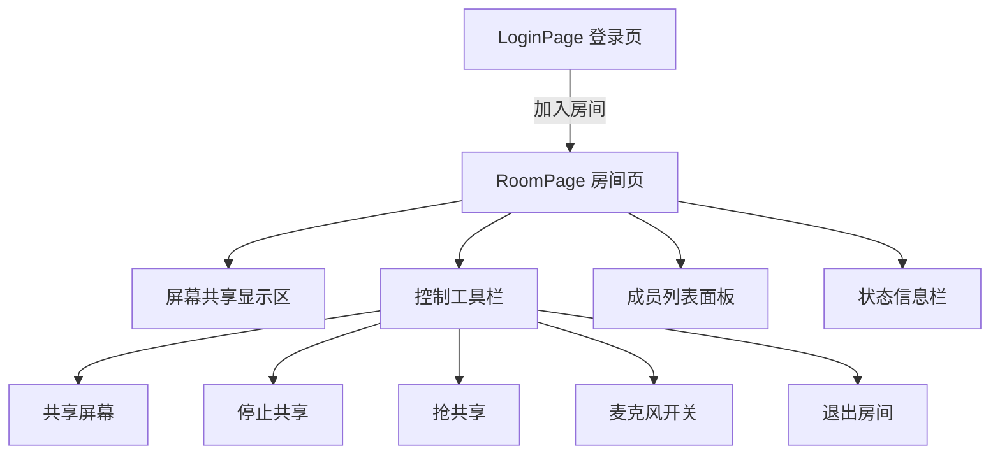
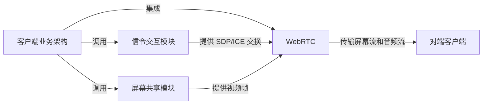

# 客户端业务架构任务规划

> [!abstract] 概述
> 局域网屏幕共享软件客户端业务架构的完整任务规划。负责人：黄俊杰（Mac端）。当前聚焦：**Phase 1 — 客户端基本页面搭建**。

## 整体架构



---

## Phase 1：基本页面搭建 ==当前阶段==

> [!todo] 目标
> 完成 LoginPage 和 RoomPage 的 UI 页面、页面导航逻辑和基础样式。

### 1.1 项目结构调整

- [ ] 创建 `pages/` 目录，按页面组织代码
- [ ] 创建 `widgets/` 目录，存放自定义控件
- [ ] 创建 `resources/` 目录，存放图标和样式资源
- [ ] 更新 CMakeLists.txt 添加新的源文件和资源

**目录结构规划：**

```
ByteDanceTest/
├── CMakeLists.txt
├── main.cpp
├── pages/
│   ├── LoginPage.h / .cpp / .ui
│   └── RoomPage.h / .cpp / .ui
├── widgets/
│   ├── ToolButton.h / .cpp        # 工具栏按钮控件
│   ├── ScreenView.h / .cpp        # 屏幕显示区域控件
│   └── MemberList.h / .cpp        # 成员列表控件
├── resources/
│   ├── resources.qrc
│   ├── icons/                     # 工具栏图标
│   └── styles/                    # QSS 样式表
└── mainwindow.h / .cpp            # 主窗口（页面容器）
```

### 1.2 登录页面（LoginPage）

- [ ] 创建 LoginPage 类（继承 QWidget）
- [ ] UI 元素：
  - 应用 Logo / 标题区域
  - 昵称输入框（QLineEdit）
  - 房间号输入框（QLineEdit）
  - "加入房间" 按钮（QPushButton）
- [ ] 输入验证（昵称和房间号不能为空）
- [ ] 加入成功后发送信号跳转到 RoomPage

### 1.3 主窗口导航（MainWindow）

- [ ] MainWindow 改为 QStackedWidget 页面容器
- [ ] 管理 LoginPage 和 RoomPage 的切换
- [ ] 通过信号槽连接页面间跳转逻辑

### 1.4 房间页面（RoomPage）

- [ ] 创建 RoomPage 类（继承 QWidget）
- [ ] UI 整体布局：
  - 中央区域：屏幕共享显示区（ScreenView）
  - 底部：控制工具栏
  - 右侧：成员列表（MemberList）
  - 顶部：房间信息栏（房间号、在线人数）
- [ ] 控制工具栏按钮：
  - 共享屏幕 / 停止共享（切换按钮）
  - 抢共享
  - 麦克风开/关（切换按钮）
  - 退出房间
- [ ] 成员列表：显示房间内所有成员，标记当前共享者和自己

### 1.5 自定义控件

- [ ] **ScreenView**: 屏幕共享内容显示区域（占位控件，后续接入 WebRTC 渲染）
- [ ] **ToolButton**: 带图标的工具栏按钮，支持选中/未选中状态切换
- [ ] **MemberList**: 成员列表项，显示昵称 + 角色（共享者/自己/普通成员）

### 1.6 样式美化

- [ ] 编写 QSS 样式表，统一视觉风格
- [ ] 深色主题风格（参考飞书会议 / 腾讯会议）
- [ ] 按钮悬停、按下、选中状态的视觉反馈
- [ ] 页面整体配色和字体规范

---

## Phase 2：房间管理逻辑

> [!info] 前置依赖
> 需要信令模块提供接口定义。

### 2.1 房间状态管理

- [ ] 定义 RoomStateManager 管理房间状态（成员列表、共享者、自己角色）
- [ ] 成员加入/离开的通知处理
- [ ] 共享者切换（抢共享）的状态同步

### 2.2 信令客户端接口

- [ ] 定义 SignalingClient 抽象接口
- [ ] 消息协议定义（加入房间、离开房间、开始共享、停止共享、抢共享）
- [ ] 与信令模块联调

---

## Phase 3：本地屏幕推流

> [!warning] 前置依赖
> 需要屏幕共享模块（俞哲钊/邢雨茁）提供屏幕采集接口。

### 3.1 屏幕采集接入

- [ ] 接入屏幕共享模块的本地采集接口
- [ ] 将采集的视频帧渲染到 ScreenView 控件
- [ ] 共享/停止共享/抢共享的流程串联

### 3.2 语音交互

- [ ] 本地音频采集（麦克风）
- [ ] 音频播放（扬声器）
- [ ] 麦克风开关控制

---

## Phase 4：附加功能（加分项）

> [!tip] 可选功能
> 这些功能为加分项，视进度决定是否实现。

### 4.1 画中画

- [ ] 主共享人摄像头视频流接入
- [ ] 悬浮小窗口显示视频画面
- [ ] 可拖拽和缩放

### 4.2 标注画笔

- [ ] 在屏幕共享画面上叠加透明绘图层
- [ ] 画笔工具（颜色、粗细）
- [ ] 标注数据同步给其他成员

---

## 关键技术点

> [!danger] 常见问题
> - macOS 需要"屏幕录制权限"，需在代码中检查并引导用户授权
> - WebRTC 的信令必须在 DataChannel 创建前完成 SDP 交换
> - 屏幕共享帧率建议 10-15 fps，分辨率适配到 1280x720 或 1920x1080
> - DesktopFrame 像素格式因平台不同（macOS 为 BGRA），需使用对应的 libyuv 转换函数

## 组件间依赖关系



## 里程碑

| 里程碑 | 内容 | 预计完成时间 |
|--------|------|-------------|
| M1 | 基本页面搭建完成，可演示页面跳转 | Week 1 末 |
| M2 | 房间管理逻辑 + 信令接口对接 | Week 2 初 |
| M3 | 本地屏幕推流功能打通 | Week 2 末 |
| M4 | 语音交互 + 全流程联调 | Week 3 |
| M5 | 附加功能 + 测试优化 | Week 3 末 |
