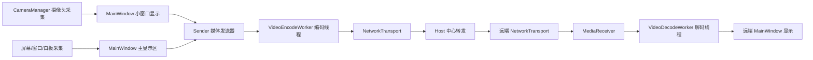

# 多人屏幕共享会议系统

## 1. 项目概述

本项目是一个基于 Qt/C++ 的多人会议原型系统，目标是实现类似飞书会议的核心能力，包括桌面共享、窗口共享、白板共享、画笔批注、摄像头小窗、系统声音/麦克风采集，以及多实例之间的实时通信。

系统采用 **Host 中心转发架构**：一个实例创建会议并作为 Host，其他实例通过会议码加入。Host 负责会议码校验、用户身份分配、参会者状态广播和媒体数据转发。每个参会者拥有独立的用户标识，接收端根据 `senderId` 将不同用户的摄像头画面显示到对应的小窗口中，并将共享屏幕显示到主窗口区域。

项目当前定位为多人会议 Demo / 原型系统，重点验证以下技术链路：

- 多人会议连接管理
- 摄像头采集与小窗显示
- 屏幕、窗口、白板共享
- 画笔批注与共享画面合成
- 视频编码、解码与实时传输
- Host 多客户端媒体转发
- 动态参会者窗口管理
- 音频采集、混音与传输接口

---

## 2. 核心功能

### 2.1 会议创建与加入

系统支持通过会议码完成会议加入流程。

- 创建会议后，Host 生成会议码并监听会议端口。
- Client 加入会议时需要输入会议码。
- Host 校验会议码，校验成功后为 Client 分配用户 ID。
- 会议成员加入或离开时，Host 会广播状态变化，所有端同步更新参会者窗口。

核心流程：

```text
Host 创建会议
    ↓
生成会议码
    ↓
QTcpServer 监听端口
    ↓
Client 输入会议码并连接
    ↓
Client 发送 Hello 消息
    ↓
Host 校验会议码
    ↓
Host 分配 userId
    ↓
Host 发送 Welcome 并广播 PeerJoined
```

---

### 2.2 多人通信与媒体转发

项目采用 Host 中心转发方式，而不是客户端全互连方式。

```text
        Client B
           |
           |
Host / Server
           |
           |
        Client C
```

当某个 Client 发送摄像头画面或共享屏幕时，数据会先发送到 Host，再由 Host 转发给其他 Client。这样可以降低连接管理复杂度，使每个 Client 只需要维护一条到 Host 的连接。

核心能力：

- Host 管理多个 Client 连接
- 每个连接对应一个 `ClientSession`
- 使用 `userId` 区分不同参会者
- Host 转发媒体包时保留原始 `senderId`
- Client 根据 `senderId` 将远端画面分发到对应 UI 区域

---

### 2.3 动态参会者小窗口

顶部参会者区域不再固定为 5 个窗口，而是根据实际参会者动态创建。

- 用户加入时自动创建小窗口
- 用户离开时自动删除小窗口
- 本机摄像头显示在本机小窗口
- 远端摄像头显示在对应远端用户小窗口
- 摄像头关闭后，小窗口恢复为占位状态

设计原则：

```text
主窗口大屏：显示共享屏幕、共享窗口、白板或远端共享内容
顶部小窗口：显示本机/远端摄像头或用户占位信息
```

---

### 2.4 摄像头采集与显示

摄像头模块基于 Qt Multimedia 实现，主要使用：

- `QCamera`
- `QMediaCaptureSession`
- `QVideoSink`
- `QVideoFrame`
- `QImage`

摄像头帧处理流程：

```text
打开摄像头
    ↓
CameraManager 创建 QCamera / QVideoSink
    ↓
QVideoSink 产生 QVideoFrame
    ↓
CameraManager 转换为 QImage
    ↓
MainWindow 显示到本机小窗口
    ↓
Sender 接收摄像头帧
    ↓
VideoEncodeWorker 编码
    ↓
NetworkTransport 发送
    ↓
远端 MediaReceiver 解码
    ↓
更新对应参会者小窗口
```

摄像头错误信息采用中文提示，常见场景包括：设备被其他程序占用、无摄像头设备、摄像头权限不足等。

---

### 2.5 屏幕、窗口与白板共享

系统支持多种共享源：

- 桌面 1
- 桌面 2
- 已打开窗口
- 白板

共享选择界面支持显示屏幕缩略图和窗口缩略图，用户可以直观选择共享目标。共享内容会显示在本机主窗口，并通过网络发送到其他参会者。

共享端结束共享时会发送 `share_off` 控制消息，远端收到后会清空主显示区域，避免停留在最后一帧。

---

### 2.6 画笔与批注

系统支持在共享内容上进行画笔批注。

- 共享桌面批注
- 共享窗口批注
- 白板书写
- 关闭画笔后保留已有笔迹
- 结束共享时清理批注状态
- 批注内容可与共享画面合成后发送

画笔入口在主窗口和共享悬浮工具条中均可访问，功能上属于同一批注模块。

---

### 2.7 音频采集与混音接口

音频模块提供基础采集、混音和播放能力：

- 麦克风采集
- 系统声音采集
- 麦克风与系统声音混音
- 远端音频播放接口
- 本地回放调试接口

音频链路当前主要作为会议 Demo 的基础能力保留，后续可以进一步扩展为多路音频混音、回声抑制、音频同步和更高效的音频编码。

---

## 3. 系统架构

项目采用功能分层结构，将 UI、媒体、网络、音频、采集、批注等逻辑拆分到不同模块中。

```text
screenshare_win/
├── src/
│   ├── app/                    # 主窗口、会议控制、UI 调度
│   ├── annotation/             # 画笔、批注、白板叠加
│   ├── audio/                  # 麦克风、系统声音、混音、播放
│   ├── capture/                # 屏幕/窗口枚举与采集抽象
│   ├── media/                  # 摄像头、发送器、接收器、视频编解码
│   ├── network/                # 多人 TCP 通信、会议码、Host 转发
│   └── platform/windows/wgc/   # Windows Graphics Capture 后端
├── docs/                       # 架构与模块说明文档
├── translations/               # 翻译资源
└── CMakeLists.txt
```

整体数据流如下：



---

## 4. 主要模块说明

### 4.1 `src/app/`

负责主界面、会议控制和 UI 调度。

| 文件 | 说明 |
|---|---|
| `mainwindow.cpp` | 主窗口基础初始化 |
| `mainwindow_meeting.cpp` | 创建会议、加入会议、会议码、参会者事件 |
| `mainwindow_camera_media.cpp` | 摄像头开关、本地/远端媒体回调 |
| `mainwindow_participants.cpp` | 动态参会者小窗口管理 |
| `mainwindow_share_logic.cpp` | 共享启动、结束、共享源切换 |
| `mainwindow_share_popup.cpp` | 共享内容选择界面、缩略图生成 |
| `mainwindow_annotation.cpp` | 画笔、批注、白板相关逻辑 |
| `mainwindow_toolbar.cpp` | 共享悬浮工具条逻辑 |
| `loginwindow.cpp` | 登录窗口逻辑 |
| `sharetoolbar.cpp` | 共享时悬浮控制栏 |

`MainWindow` 是系统总控入口，但具体实现已经按功能拆分到多个 `mainwindow_*.cpp` 文件中，以降低单文件复杂度。

---

### 4.2 `src/network/`

网络层核心文件：

| 文件 | 说明 |
|---|---|
| `networktransport.h` | 网络接口、消息类型、连接状态信号定义 |
| `networktransport.cpp` | Host/Client 通信、会议码校验、多客户端转发 |

核心类：

```cpp
TcpPacketTransport
```

主要职责：

- Host 创建会议
- Client 加入会议
- 会议码校验
- 用户 ID 分配
- 参会者加入/离开广播
- 媒体包封装与发送
- Host 多客户端媒体转发
- TCP 粘包/半包处理
- 非可靠视频包缓冲保护

消息类型：

| EnvelopeType | 含义 |
|---|---|
| `Hello` | Client 申请加入会议 |
| `Welcome` | Host 允许加入并分配身份 |
| `Reject` | Host 拒绝加入，例如会议码错误 |
| `PeerJoined` | 有用户加入会议 |
| `PeerLeft` | 有用户离开会议 |
| `Media` | 摄像头、共享屏幕、音频或控制消息 |

网络包采用外层 Envelope 结构：

```text
Envelope:
  type
  senderId
  userName
  payloadSize
  payload
```

其中 `payload` 可以是 Sender 生成的媒体包。

为了处理 TCP 粘包问题，发送时在每个 Envelope 前增加 4 字节长度头：

```text
[4 字节长度][Envelope 内容]
```

接收端为每个 socket 维护独立 `readBuffer`，只有完整包到达后才调用解析逻辑。

---

### 4.3 `src/media/`

媒体层负责摄像头、发送、接收、视频编码和解码。

| 文件 | 说明 |
|---|---|
| `cameramanager.cpp` | 摄像头设备枚举、打开、关闭、帧转换 |
| `sender.cpp` | 本地媒体流注册、打包、队列、发送 |
| `mediareceiver.cpp` | 远端媒体包解析和分发 |
| `videoencodeworker.cpp` | 独立线程视频编码 |
| `videodecodeworker.cpp` | 独立线程视频解码 |

核心设计：

- 摄像头帧使用 `QImage` 作为内部统一格式
- 主共享画面普通模式使用高清无损编码
- 流畅模式使用压缩编码以提高实时性
- 摄像头流限制尺寸和帧率，适合小窗口显示
- 视频编码、解码放到独立线程，避免阻塞 UI
- 发送队列只保留最新视频帧，降低延迟

---

### 4.4 `src/annotation/`

批注层负责画笔和白板操作。

| 文件 | 说明 |
|---|---|
| `annotationoverlay.cpp` | 实际绘制笔迹、文字、橡皮擦等 |
| `annotationwindow.cpp` | 批注窗口和浮动工具条封装 |

主要能力：

- 鼠标轨迹绘制
- 文字批注
- 橡皮擦
- 清空批注
- 批注图层导出为图像
- 与共享画面合成

---

### 4.5 `src/audio/`

音频层负责声音采集、混音和播放。

| 文件 | 说明 |
|---|---|
| `audiocapturer.cpp` | 麦克风采集 |
| `systemaudiocapturer.cpp` | 系统声音采集 |
| `audiomixer.cpp` | 麦克风与系统声音混音 |
| `audioplayer.cpp` | PCM 音频播放 |

---

### 4.6 `src/capture/`

采集层用于屏幕/窗口源枚举和采集抽象。

| 文件 | 说明 |
|---|---|
| `sourceenumerator.cpp` | 枚举屏幕和可共享窗口 |
| `screencapturer.cpp` | 屏幕/窗口采集抽象层 |

该层为后续统一 DXGI、WGC、GDI、PrintWindow 等采集方式提供扩展基础。

---

### 4.7 `src/platform/windows/wgc/`

Windows 平台采集后端，用于窗口采集扩展。

| 文件 | 说明 |
|---|---|
| `wgcwindowcapturebackend.cpp` | Windows Graphics Capture 窗口采集后端 |

设计目标是为窗口共享提供更稳定的实时采集能力，并在必要时与其他采集方式进行降级配合。

---

## 5. 关键流程说明

### 5.1 创建会议流程

```text
MainWindow::startHostMeeting()
    ↓
生成会议码
    ↓
TcpPacketTransport::listen()
    ↓
设置 m_serverMode = true
    ↓
设置本机 userId = host
    ↓
保存会议码
    ↓
QTcpServer::listen()
    ↓
等待 Client 连接
```

---

### 5.2 加入会议流程

```text
MainWindow::connectLocalMeeting()
    ↓
输入会议码
    ↓
TcpPacketTransport::connectToPeer()
    ↓
创建 QTcpSocket
    ↓
connectToHost()
    ↓
onClientConnected()
    ↓
sendHello()
    ↓
Host 校验会议码
```

---

### 5.3 会议码校验流程

```text
Client sendHello()
    ↓
Host onSocketReadyRead()
    ↓
handleEnvelope()
    ↓
handleServerEnvelope(Hello)
    ↓
解析 requestedCode
    ↓
比较 requestedCode 与 m_meetingCode
    ↓
错误：Reject 并断开
正确：分配 userId，发送 Welcome，广播 PeerJoined
```

---

### 5.4 摄像头采集与发送流程

```text
btnCamera clicked
    ↓
MainWindow::toggleCamera()
    ↓
CameraManager::startCameraByIndex()
    ↓
QCamera::start()
    ↓
QVideoSink::videoFrameChanged
    ↓
CameraManager::onVideoFrameChanged()
    ↓
emit frameReady(QImage)
    ↓
MainWindow::onLocalCameraFrame()
    ↓
updateParticipantVideo(localUserId, image)
    ↓
Sender::onPipFrameCaptured(image)
    ↓
VideoEncodeWorker 编码
    ↓
NetworkTransport::sendPacket()
```

---

### 5.5 Host 媒体转发流程

```text
Client Sender
    ↓
NetworkTransport::sendPacket()
    ↓
writeEnvelope(Media)
    ↓
Host handleServerEnvelope(Media)
    ↓
根据 socket 找到 ClientSession
    ↓
emit packetReceivedFromPeer(senderId, payload)
    ↓
Host 本地显示该媒体
    ↓
broadcastMedia(senderId, userName, payload)
    ↓
转发给其他 Client
```

---

### 5.6 远端摄像头显示流程

```text
Client 收到 Media
    ↓
handleClientEnvelope(Media)
    ↓
emit packetReceivedFromPeer(senderId, payload)
    ↓
MainWindow::onMeetingPacketReceived()
    ↓
receiverForPeer(senderId)
    ↓
MediaReceiver::onPacketReceived()
    ↓
VideoDecodeWorker 解码
    ↓
cameraFrameReceived(image)
    ↓
updateParticipantVideo(senderId, image)
    ↓
显示到对应参会者小窗口
```

---

### 5.7 用户离开流程

```text
socket disconnected
    ↓
onSocketDisconnected()
    ↓
removeSocket()
    ↓
broadcastPeerLeft()
    ↓
participantLeft()
    ↓
removeParticipantTile()
```

---

## 6. 实时性与性能设计

### 6.1 编码与解码线程

视频编码和解码均放在独立 worker 中执行：

- `VideoEncodeWorker`
- `VideoDecodeWorker`

这样可以避免 PNG/JPEG 编解码阻塞主线程，提升 UI 响应性。

---

### 6.2 最新帧优先策略

视频会议更关注实时性，而不是完整保留每一帧。

因此发送端采用“只保留最新帧”的策略：

```text
如果上一帧还在编码
    ↓
新帧到来时替换旧 pending 帧
    ↓
编码完成后只处理最新 pending 帧
```

这样可以避免因编码或网络变慢导致画面延迟持续增加。

---

### 6.3 TCP 缓冲保护

对于非可靠视频包，如果 socket 待发送缓冲区过大，系统会主动丢弃部分视频帧。

```text
非可靠包 + TCP bytesToWrite 超过阈值
    ↓
丢弃当前包
```

控制消息、用户加入离开、摄像头关闭、共享结束等重要消息仍以可靠方式发送。

---

### 6.4 高清与流畅模式

主共享画面支持不同策略：

| 模式 | 特点 |
|---|---|
| 高清模式 | 保持较高清晰度，适合文字和界面展示 |
| 流畅模式 | 限制分辨率并压缩，降低带宽和编码压力 |

摄像头画面主要用于小窗口，因此会限制尺寸和帧率，以减少多用户场景下的性能压力。

---

## 7. 关键设计决策

### 7.1 采用 Host 中心转发而不是全互连

全互连模式下，n 个用户需要维护：

```text
n × (n - 1) / 2
```

条连接。随着用户数量增加，连接管理、状态同步和媒体转发都会迅速复杂化。

中心转发模式下，n 个用户只需要：

```text
n - 1
```

条 Client 到 Host 的连接，结构更加清晰，也更适合作为会议 Demo 的基础架构。

---

### 7.2 使用 `senderId` 进行用户级媒体分发

每个媒体包在会议层都会携带发送者 ID。

接收端根据 `senderId` 判断：

- 这个摄像头画面属于哪个用户
- 应该更新哪个小窗口
- 这个共享画面来自哪个参会者

这使多人小窗口显示成为可能。

---

### 7.3 外层 Envelope 与内层媒体包分离

系统将网络会议层和媒体内容层分离：

```text
外层 Envelope：负责会议消息类型、senderId、userName
内层 Payload：负责具体媒体内容，如摄像头帧、共享屏幕帧、音频帧
```

这样可以保持网络层和媒体层解耦，便于后续扩展新的消息类型或媒体类型。

---

## 8. 后续扩展方向

当前系统已经完成多人会议 Demo 的核心链路，后续可以继续扩展：

- 局域网主机 IP 输入
- 会议成员权限控制
- 独立会议服务器进程
- H.264 / H.265 视频编码
- Opus 音频编码
- 多路音频混音与回声处理
- 更完整的窗口共享后端
- 共享控制权申请与切换
- WebRTC 化通信架构
- NAT 穿透与公网会议支持

---

## 9. 项目总结

本项目实现了一个具备多人会议核心能力的 Qt/C++ 原型系统。系统支持通过会议码创建和加入会议，采用 Host 中心转发架构完成多实例通信，并实现了摄像头小窗、动态参会者管理、屏幕/窗口/白板共享、画笔批注、音频采集接口和实时媒体传输。

项目重点验证了从本地媒体采集、编码、网络发送、Host 转发、远端接收、解码到 UI 显示的完整链路，为后续扩展成更完整的网络会议系统奠定了基础。
