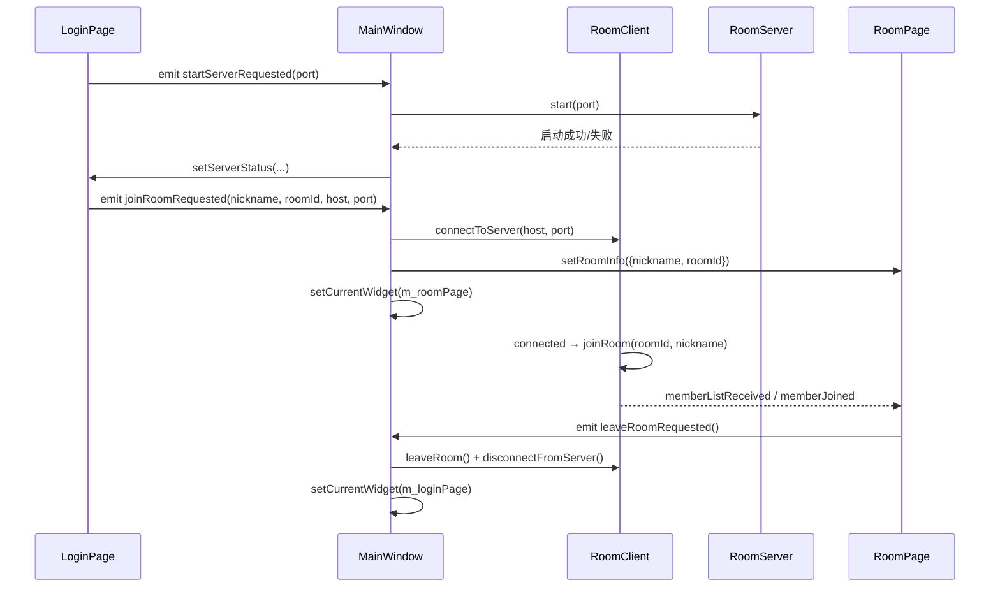
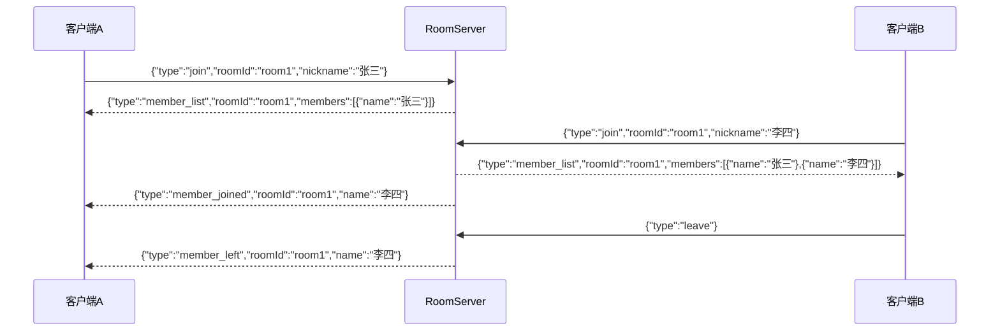
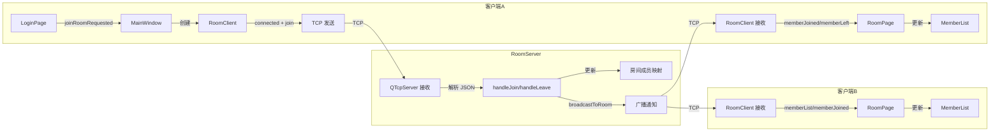
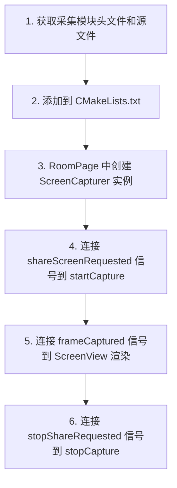

# 核心功能实现文档

> [!abstract] 文档目的
> 记录客户端业务架构的核心代码实现细节，以及后续与屏幕采集模块对接的指南。

---

## 一、项目文件结构

```
ByteDanceTest/
├── CMakeLists.txt              # 构建配置
├── main.cpp                    # 入口：全局深色 QPalette 初始化
├── mainwindow.h / .cpp         # 主窗口：QStackedWidget 页面容器
├── pages/
│   ├── LoginPage.h / .cpp      # 登录页（含服务器地址和启动服务器功能）
│   └── RoomPage.h / .cpp       # 房间页（含成员同步）
├── widgets/
│   ├── ScreenView.h / .cpp     # 屏幕渲染区域控件
│   ├── MemberList.h / .cpp     # 成员列表控件
│   └── ToolButton.h / .cpp     # 工具栏按钮控件（预留）
├── network/
│   ├── RoomServer.h / .cpp     # TCP 房间管理服务器
│   └── RoomClient.h / .cpp     # TCP 房间客户端
└── resources/                  # 资源目录（图标/样式，预留）
```

---

## 二、核心模块实现细节

### 2.1 页面导航 — MainWindow

**文件**：`mainwindow.h` / `mainwindow.cpp`

**职责**：作为页面容器，管理 LoginPage 和 RoomPage 的切换，同时持有 `RoomServer` 和 `RoomClient` 实例。

**实现方式**：

| 组件 | 说明 |
|------|------|
| `QStackedWidget *m_stackWidget` | 栈式页面容器，一次只显示一个页面 |
| `LoginPage *m_loginPage` | 登录页实例 |
| `RoomPage *m_roomPage` | 房间页实例 |
| `RoomServer *m_server` | 房间管理服务器（可选启动） |
| `RoomClient *m_client` | 房间客户端（加入房间时创建） |

**导航流程**：



**信号连接**（`mainwindow.cpp`）：

```cpp
// 登录页信号
connect(m_loginPage, &LoginPage::joinRoomRequested, this, &MainWindow::onJoinRoom);
connect(m_loginPage, &LoginPage::startServerRequested, this, &MainWindow::onStartServer);
connect(m_roomPage, &RoomPage::leaveRoomRequested, this, &MainWindow::onLeaveRoom);

// 网络客户端 → RoomPage 成员同步
connect(m_client, &RoomClient::memberListReceived, m_roomPage, &RoomPage::onMemberListReceived);
connect(m_client, &RoomClient::memberJoined, m_roomPage, &RoomPage::onMemberJoined);
connect(m_client, &RoomClient::memberLeft, m_roomPage, &RoomPage::onMemberLeft);
```

---

### 2.2 登录页面 — LoginPage

**文件**：`pages/LoginPage.h` / `pages/LoginPage.cpp`

**UI 结构**：

```
┌────────────────────────────┐
│   整体 QVBoxLayout 居中      │
│  ┌──────────────────────┐  │
│  │   #loginCard 卡片     │  │
│  │                      │  │
│  │   "屏幕共享" (标题)    │  │
│  │   "局域网屏幕共享软件"  │  │
│  │                      │  │
│  │   昵称                │  │
│  │   [昵称输入框]         │  │
│  │   房间号               │  │
│  │   [房间号输入框]        │  │
│  │   服务器地址            │  │
│  │   [IP输入框] [端口输入]  │  │
│  │                      │  │
│  │   [启动房间服务器]      │  │
│  │   (服务器状态文字)      │  │
│  │                      │  │
│  │   [ 加入房间 ]         │  │
│  └──────────────────────┘  │
└────────────────────────────┘
```

**新增 UI 元素**：

| 元素 | 说明 |
|------|------|
| `m_serverEdit` | 服务器 IP 输入框，默认 `127.0.0.1` |
| `m_portEdit` | 端口输入框，默认 `9527` |
| `m_serverStatus` | 服务器启动状态文字（绿色成功/红色失败） |

**信号变更**：

```cpp
// 旧信号
void joinRoomRequested(const QString &nickname, const QString &roomId);
// 新信号（新增服务器地址参数）
void joinRoomRequested(const QString &nickname, const QString &roomId,
                       const QString &serverHost, quint16 serverPort);
// 新增信号
void startServerRequested(quint16 port);
```

---

### 2.3 房间页面 — RoomPage

**文件**：`pages/RoomPage.h` / `pages/RoomPage.cpp`

**UI 结构**：

```
┌─────────────────────────────────────────────┐
│ 顶部信息栏 (40px)          房间号 | 在线人数  │
├──────────────────────────────┬──────────────┤
│                              │  成员列表     │
│                              │  ─────────   │
│     ScreenView               │  👤 昵称[我]  │
│     (屏幕显示区)              │  👤 用户B    │
│                              │  👤 用户C    │
│                              │  [共享中]    │
├──────────────────────────────┴──────────────┤
│ 底部工具栏 (72px)                            │
│ [共享屏幕] [抢共享] [🎤麦克风] [退出房间]      │
└─────────────────────────────────────────────┘
```

**新增成员同步方法**：

| 方法 | 触发来源 | 说明 |
|------|---------|------|
| `onMemberListReceived(roomId, members)` | RoomClient 信号 | 服务器返回完整成员列表，覆盖本地列表 |
| `onMemberJoined(roomId, name)` | RoomClient 信号 | 新成员加入，追加到列表 |
| `onMemberLeft(roomId, name)` | RoomClient 信号 | 成员离开，从列表移除 |
| `resetRoom()` | MainWindow 调用 | 退出房间时重置所有状态 |
| `updateMemberCount()` | 内部调用 | 根据列表项数量更新"在线: N 人" |

**信号定义**（`RoomPage.h`）：

| 信号 | 触发条件 | 用途 |
|------|---------|------|
| `leaveRoomRequested()` | 点击退出房间 | 返回登录页 |
| `shareScreenRequested()` | 点击共享屏幕 | 开始屏幕采集 |
| `stopShareRequested()` | 点击停止共享 | 停止屏幕采集 |
| `grabShareRequested()` | 点击抢共享 | 切换共享者 |
| `micToggleRequested(bool)` | 点击麦克风 | 开关麦克风 |

**共享按钮状态切换**（`RoomPage.cpp`）：

- 未共享状态：按钮文字"共享屏幕"，蓝色背景（`#2d5aa0`）
- 共享中状态：按钮文字"停止共享"，红色背景（`#c0392b`），ScreenView 显示"正在共享屏幕..."

---

### 2.4 屏幕显示控件 — ScreenView

**文件**：`widgets/ScreenView.h` / `widgets/ScreenView.cpp`

**当前状态**：占位控件，通过 `paintEvent` 绘制背景和提示文字。

**核心接口**：

```cpp
void setPlaceholderText(const QString &text);
void paintEvent(QPaintEvent *event) override;
```

> [!important] 对接关键点
> **这是后续对接屏幕采集模块的核心入口。** 当采集模块就绪后，需要在此控件中接收视频帧并渲染。详见[[#四、屏幕采集模块对接指南]]。

---

### 2.5 成员列表控件 — MemberList

**文件**：`widgets/MemberList.h` / `widgets/MemberList.cpp`

**数据结构**（`MemberList.h:6-10`）：

```cpp
struct MemberInfo {
    QString name;            // 成员昵称
    bool isSharing = false;  // 是否正在共享
    bool isMe = false;       // 是否是自己
};
```

**接口**：

| 方法 | 说明 |
|------|------|
| `setMembers(list)` | 批量设置成员列表 |
| `addMember(info)` | 添加单个成员 |
| `removeMember(name)` | 按昵称移除成员 |
| `clearMembers()` | 清空列表 |
| `setMyName(name)` | 标记自己的名称 |

**显示规则**：共享中的成员名称显示为蓝色（`#4fc3f7`），标注"共享中"；自己的名称标注"我"。

---

### 2.6 工具栏按钮 — ToolButton

**文件**：`widgets/ToolButton.h` / `widgets/ToolButton.cpp`

**当前状态**：已实现但未在 RoomPage 中使用（RoomPage 直接使用了 QPushButton），留作后续工具栏升级时使用。

**特性**：支持图标+文字上下排列、选中高亮状态。

---

## 三、房间网络同步模块

### 3.1 概述

**文件**：`network/RoomServer.h / .cpp`、`network/RoomClient.h / .cpp`

通过 TCP 长连接实现局域网内多客户端的房间成员同步。服务器维护 `房间号 → 成员列表` 的映射，客户端加入/离开时自动广播通知。

**使用方式**：

1. 第一个客户端在登录页点击"启动房间服务器"（在本机启动 RoomServer，端口 9527）
2. 所有客户端填写服务器 IP 和端口，输入昵称和房间号后点击"加入房间"
3. 服务器维护房间成员列表，自动广播成员变更
4. 多个客户端输入相同房间号，即可看到彼此

### 3.2 通信协议

基于 TCP 的 JSON 文本行协议，每条消息为一行紧凑 JSON，以 `\n` 结尾。



**客户端 → 服务器**：

| 消息类型 | 字段 | 说明 |
|---------|------|------|
| `join` | `roomId`, `nickname` | 加入房间 |
| `leave` | 无 | 离开房间（断开连接自动触发） |

**服务器 → 客户端**：

| 消息类型 | 字段 | 说明 |
|---------|------|------|
| `member_list` | `roomId`, `members[]` | 完整成员列表（加入时返回） |
| `member_joined` | `roomId`, `name` | 新成员加入通知 |
| `member_left` | `roomId`, `name` | 成员离开通知 |

### 3.3 RoomServer 实现细节

**文件**：`network/RoomServer.h` / `network/RoomServer.cpp`

**核心数据结构**：

```cpp
// 每个连接的客户端信息
struct ClientInfo {
    QTcpSocket *socket;
    QString nickname;
    QString roomId;
};

QTcpServer *m_server;                    // TCP 监听服务器
QMap<QTcpSocket*, ClientInfo> m_clients; // socket → 客户端信息
QMap<QString, QSet<QTcpSocket*>> m_rooms; // 房间号 → 该房间的所有 socket
```

**核心方法**：

| 方法 | 说明 |
|------|------|
| `start(port)` | 启动 TCP 监听 |
| `stop()` | 停止服务器，断开所有客户端 |
| `handleJoin(socket, msg)` | 处理加入房间：更新映射、发送成员列表、广播加入通知 |
| `handleLeave(socket)` | 处理离开房间：清理映射、广播离开通知 |
| `broadcastToRoom(roomId, msg, exclude)` | 向房间内所有人广播消息（可排除某个 socket） |
| `buildMemberList(roomId)` | 构建房间成员的 JSON 数组 |

**关键实现逻辑**：

- **新连接**（`onNewConnection`）：创建 socket，加入 `m_clients`，绑定 `readyRead` 和 `disconnected` 信号
- **消息解析**（`onReadyRead`）：逐行读取，解析 JSON，根据 `type` 分发到 `handleJoin` 或 `handleLeave`
- **断开连接**（`onDisconnected`）：自动调用 `handleLeave` 清理房间，然后从 `m_clients` 移除

### 3.4 RoomClient 实现细节

**文件**：`network/RoomClient.h` / `network/RoomClient.cpp`

**核心方法**：

| 方法 | 说明 |
|------|------|
| `connectToServer(host, port)` | 异步连接服务器 |
| `disconnectFromServer()` | 断开连接（自动发送 leave） |
| `joinRoom(roomId, nickname)` | 发送 join 消息 |
| `leaveRoom()` | 发送 leave 消息 |

**信号**：

| 信号 | 说明 |
|------|------|
| `connected()` | TCP 连接成功 |
| `disconnected()` | TCP 连接断开 |
| `errorOccurred(QString)` | 连接错误 |
| `memberListReceived(roomId, members)` | 收到完整成员列表 |
| `memberJoined(roomId, name)` | 新成员加入 |
| `memberLeft(roomId, name)` | 成员离开 |

**连接成功自动加入**：

```cpp
// MainWindow::onJoinRoom 中的连接逻辑
connect(m_client, &RoomClient::connected, this, [this]() {
    m_client->joinRoom(m_roomId, m_nickname);
}, Qt::QueuedConnection);
```

### 3.5 数据流转路径



### 3.6 本地测试步骤

> [!tip] 多客户端联调
> 1. 启动第一个 `ByteDanceTest.exe`
> 2. 点击 **"启动房间服务器"**，看到绿色提示"服务器启动成功"
> 3. 填写昵称和房间号，点击 **"加入房间"**
> 4. 再启动第二个 `ByteDanceTest.exe`（直接双击 exe）
> 5. 填写不同昵称，**相同房间号**，服务器地址保持 `127.0.0.1:9527`
> 6. 点击 **"加入房间"**，两个窗口的成员列表都会显示 2 人

---

## 四、屏幕采集模块对接指南

> [!danger] 对接前提
> 屏幕采集模块（俞哲钊/邢雨茁负责 macOS，蒋宗原/韦燕丹负责 Windows）需要提供以下接口才能对接。

### 4.1 采集模块需要提供的接口

屏幕采集模块应该封装为一个类（例如 `ScreenCapturer`），至少提供以下接口：

```cpp
// 预期的采集模块接口
class ScreenCapturer {
public:
    // 获取可用的屏幕/窗口列表
    struct CaptureSource {
        int id;
        QString title;    // 窗口标题或屏幕名称
        bool isScreen;    // true=屏幕, false=窗口
    };
    QList<CaptureSource> getSourceList();

    // 选择采集源
    bool selectSource(int sourceId);

    // 开始/停止采集
    bool startCapture(int fps = 15);
    void stopCapture();

    // 判断是否正在采集
    bool isCapturing() const;

signals:
    // 每帧采集完成时发射，携带帧数据
    void frameCaptured(const QImage &frame);
};
```

### 4.2 对接步骤



### 4.3 具体对接代码位置和修改

#### 修改 1：CMakeLists.txt 添加采集模块

在 `qt_add_executable` 中添加采集模块的源文件：

```cmake
qt_add_executable(ByteDanceTest
    # ... 现有文件 ...
    capture/ScreenCapturer.cpp    # 新增
    capture/ScreenCapturer.h      # 新增
)
```

#### 修改 2：ScreenView 增加帧渲染能力

**文件**：`widgets/ScreenView.h` / `widgets/ScreenView.cpp`

需要增加的方法：

```cpp
// ScreenView.h 新增
public:
    void updateFrame(const QImage &frame);

private:
    QImage m_currentFrame;
```

```cpp
// ScreenView.cpp 修改 paintEvent
void ScreenView::paintEvent(QPaintEvent *event)
{
    QPainter painter(this);
    painter.setRenderHint(QPainter::Antialiasing);

    if (!m_currentFrame.isNull()) {
        QImage scaled = m_currentFrame.scaled(
            size(), Qt::KeepAspectRatio, Qt::SmoothTransformation);
        int x = (width() - scaled.width()) / 2;
        int y = (height() - scaled.height()) / 2;
        painter.drawImage(x, y, scaled);
    } else {
        painter.fillRect(rect(), QColor("#1a1a2e"));
        painter.setPen(QColor("#666666"));
        painter.setFont(QFont("Microsoft YaHei", 14));
        painter.drawText(rect(), Qt::AlignCenter, m_placeholderText);
    }
}

void ScreenView::updateFrame(const QImage &frame)
{
    m_currentFrame = frame;
    update();
}
```

#### 修改 3：RoomPage 连接采集模块

**文件**：`pages/RoomPage.h` / `pages/RoomPage.cpp`

```cpp
// RoomPage.h 新增
#include "capture/ScreenCapturer.h"

private:
    ScreenCapturer *m_capturer = nullptr;

// RoomPage.cpp 构造函数中初始化
m_capturer = new ScreenCapturer(this);

connect(m_capturer, &ScreenCapturer::frameCaptured,
        m_screenView, &ScreenView::updateFrame);

// 修改 onShareClicked
void RoomPage::onShareClicked()
{
    if (!m_isSharing) {
        if (m_capturer->startCapture(15)) {
            m_isSharing = true;
            m_shareBtn->setText("停止共享");
            // ... 更新按钮样式 ...
        }
    } else {
        m_capturer->stopCapture();
        m_isSharing = false;
        m_shareBtn->setText("共享屏幕");
        m_screenView->setPlaceholderText("等待屏幕共享...");
    }
}
```

### 4.4 联调检查清单

> [!todo] 对接前确认
> - [ ] 确认采集模块的头文件路径和类名
> - [ ] 确认 `frameCaptured` 信号的参数格式（QImage / 原始数据+宽高）
> - [ ] 确认像素格式（BGRA / ARGB / RGB），用于颜色转换
> - [ ] 确认 macOS 屏幕录制权限的处理方式
> - [ ] 确认采集模块是否线程安全（采集线程 vs UI 线程）
> - [ ] 在 CMakeLists.txt 中添加采集模块的源文件和 include 路径
> - [ ] 编译联调，验证帧能正确渲染到 ScreenView

---

## 五、全局配色方案

| 用途 | 色值 | 使用位置 |
|------|------|---------|
| 窗口背景 | `#1e1e1e` | main.cpp QPalette |
| 卡片/面板背景 | `#2b2b2b` | LoginPage、MemberList、右侧面板 |
| 工具栏/顶栏背景 | `#252525` | RoomPage 顶部和底部栏 |
| 按钮默认背景 | `#3a3a3a` | 抢共享、麦克风、启动服务器按钮 |
| 主色调（蓝） | `#2d5aa0` | 加入房间、共享屏幕按钮 |
| 危险色（红） | `#c0392b` | 退出房间、停止共享按钮 |
| 成功色（绿） | `#4caf50` | 服务器启动成功状态文字 |
| 错误色（红） | `#e74c3c` | 服务器启动失败/连接错误状态文字 |
| 屏幕区背景 | `#1a1a2e` | ScreenView |
| 主要文字 | `#cccccc` | 标题、标签 |
| 次要文字 | `#888888` | 副标题、人数 |
| 共享者标记 | `#4fc3f7` | MemberList 中共享者名称 |
| 边框线 | `#3a3a3a` | 分割线、输入框边框 |

---

## 六、依赖项

| 依赖 | 用途 |
|------|------|
| `Qt6::Core` | 基础类型、信号槽、JSON 解析 |
| `Qt6::Widgets` | UI 控件（QWidget、QLabel、QPushButton 等） |
| `Qt6::Network` | TCP 通信（QTcpServer、QTcpSocket） |
